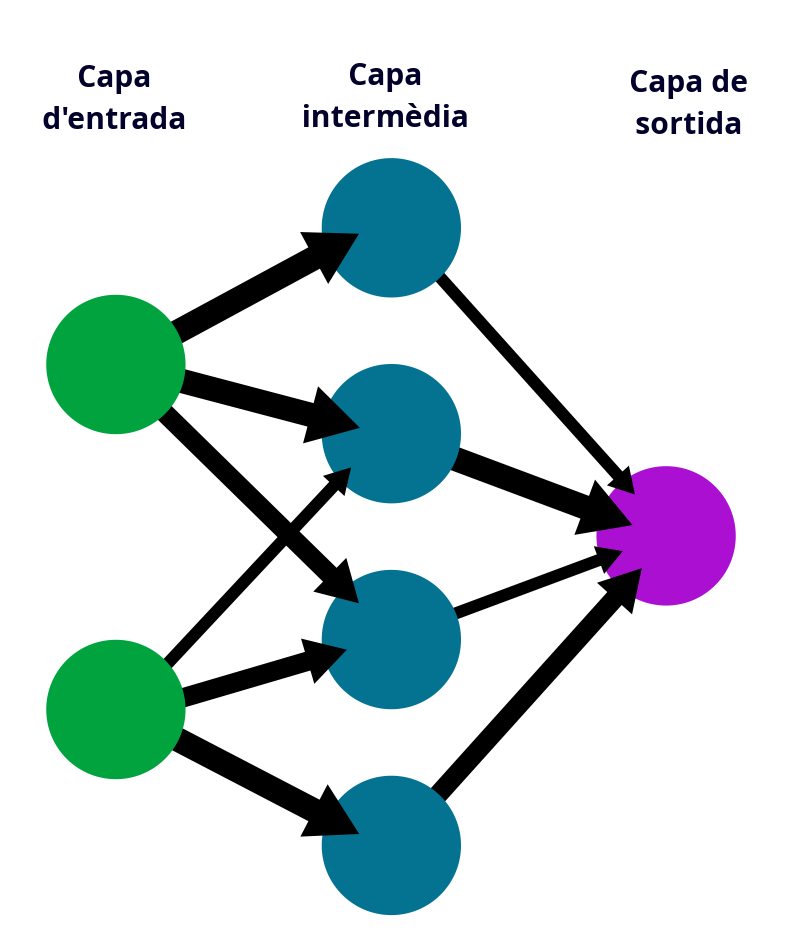
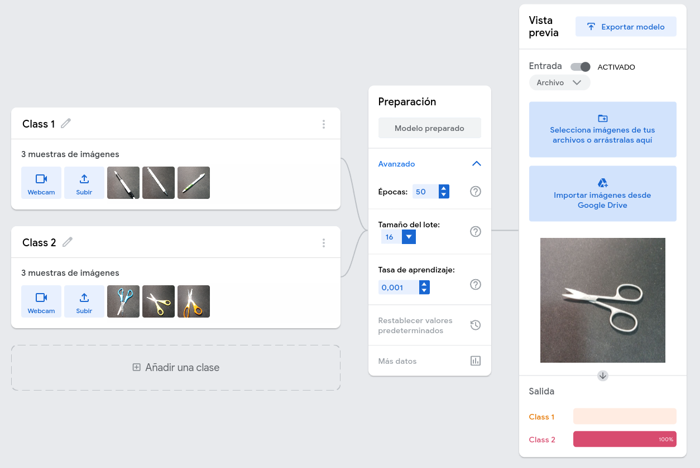
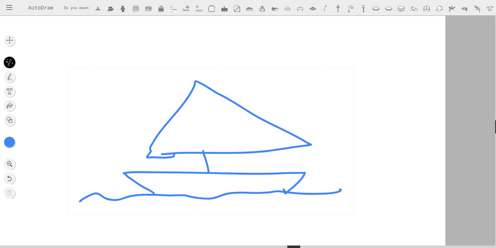
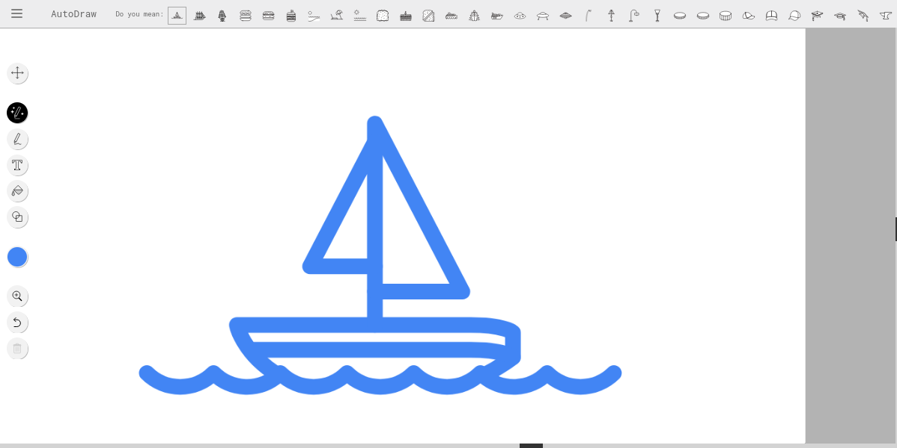
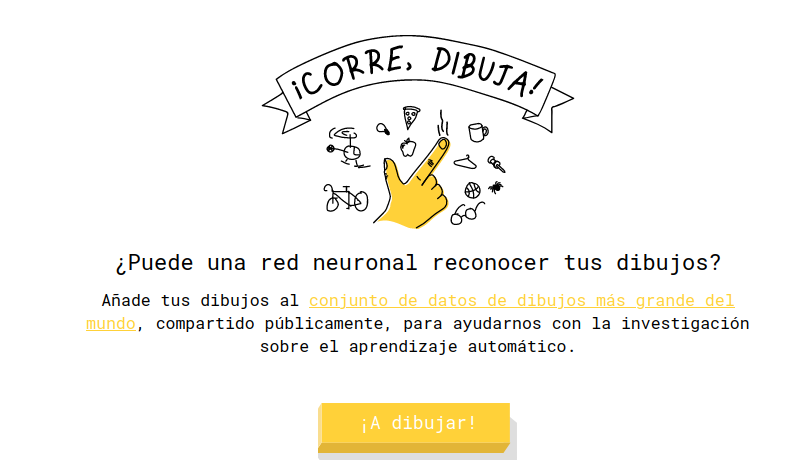
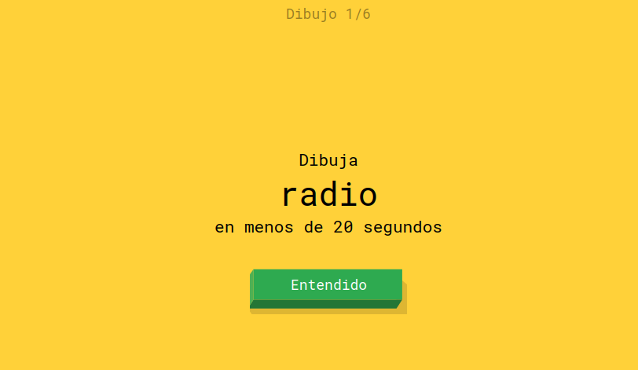
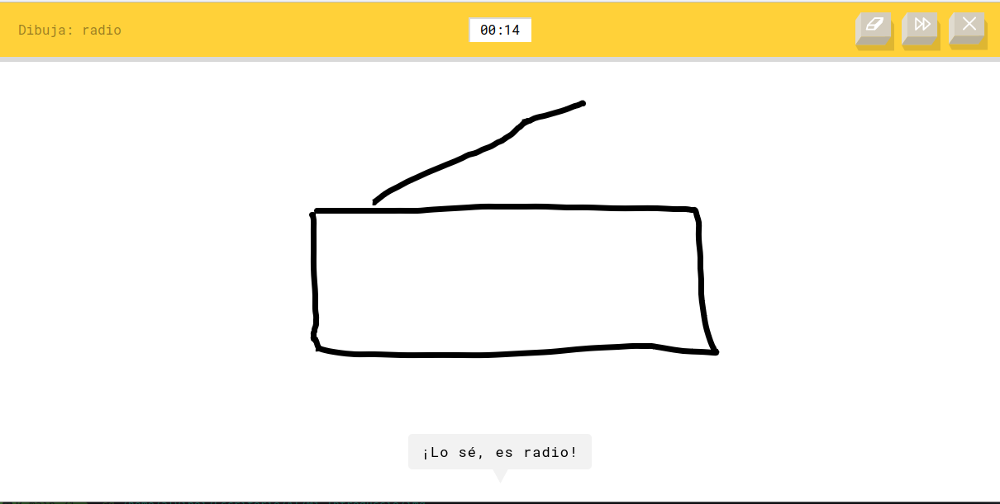
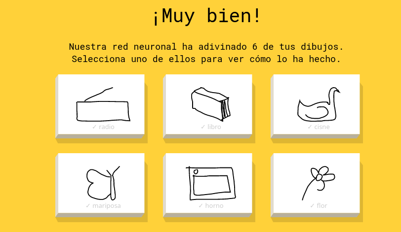

---
# Información general del documento
title: 1. Introducción. Conceptos iniciales
lang: can
page-background: img/bg.png
linkcolor: blue

# Portada
titlepage: true
titlepage-rule-height: 2
titlepage-rule-color: AA0000
titlepage-text-color: AA0000
titlepage-background: U1.png

# Tabla de contenidos
toc: true
toc-own-page: true
toc-title: Contenidos

# Cabeceras y pies
header-left: 1. Introducción. Conceptos iniciales
header-right: Curso 2024-2025
footer-left: CEFIRE FP
footer-right: \thepage/\pageref{LastPage}

# Imágenes
float-placement-figuro: H
caption-justification: centering

# Listados de código
listings-no-page-break: true
listings-disable-line-numbers: false

header-includes:
- |
  ```{=latex}
  \usepackage{lastpage}
  \usepackage{awesomebox}
  \usepackage{caption}
  \usepackage{array}
  \usepackage{tabularx}
  \usepackage{ragged2e}
  \usepackage{multirow}
  \usepackage{xcolor}
  \setkeys{Gin}{width=\maxwidth,height=\maxheight,keepaspectratio}

  ```
pandoc-latex-environment:
  noteblock: [note]
  tipblock: [tip]
  warningblock: [warning]
  cautionblock: [caution]
  importantblock: [important]
...

<!-- \awesomebox[violet]{2pt}{\faRocket}{violet}{Lorem ipsum…} -->

<!-- \awesomebox[violet]{2pt}{\faRobot}{violet}{Lorem ipsum…} -->

<!-- IMATGE  -->

<!-- \textbf{greatest} -->

\vspace{\fill}

{ height=50px }

Este documento está sujeto a una licencia creative commons que permite su difusión y uso comercial reconociendo siempre la autoría de su creador. Este documento se encuentra para ser modificado en el siguiente repositorio de github:
<!-- CANVIAR L'ENLLAÇ -->
[https://github.com/arvicenteboix/AIcurscefire24](https://github.com/arvicenteboix/AIcurscefire24)
\newpage

# Introducción

A buen seguro que muchos de vosotros ya habéis oído hablar de la inteligencia artificial y de todo aquello que puede hacer, algunos ya habéis empezado a utilizarla en vuestro día a día y hay que distinguir algunos conceptos sobre lo que es la IA. En este curso trataremos de haceros una introducción sobre las diferentes herramientas que existen y como sacarles provecho. 

Hay que tener en cuenta que se trata de un curso de iniciación y es posible que os sintáis abrumados de toda la información que vayáis a ver, obviamente por la duración del curso no vamos a poder profundizar en muchas de las utilidades que os presentaremos, esto ya os lo dejaremos a vosotros.

Los módulos serán breves pero intensos, trataremos de ayudaros en todas las dudas que se os planteen, prácticamente todo el texto escrito está redactado y no se ha utilizado la IA, algunas imágenes son la excepción, en muchos casos os presentaremos el prompt[^1] y la respuesta que nos dará, trataremos de limitar la extensión a lo que realmente necesitáis. Las respuestas os decimos que estarán retocadas puesto que la respuesta que obtiene cualquier plataforma siempre tiene que retocarse para que sea lo más idónea posible a lo que deseas. Os lo presentaremos con el siguiente icono.

[^1]: Prompt, es el texto que escribes a la plataforma para que interpreto el que realmente necesitas. Entraremos con más detalle a la próxima unidad.

\awesomebox[violet]{2pt}{\faRobot}{violet}{\textbf{Esto será un ejemplo de prompt y posteriormente mostraremos un ejemplo de respuesta.}\hfill \break

BPerfecto, entonces. ¿Quieres hacer algún ajuste más o probar con algo específico antes de seguir adelante?}

Obviamente es una respuesta muy estándar que no se nos hubiera ocurrido escribir. Pero es lo que está respondiendo la plataforma.

\awesomebox[violet]{2pt}{\faRobot}{violet}{\textbf{¿Qué debo saber sobre inteligencia artificial?}\hfill \break
La Inteligencia Artificial (IA) es un campo fascinante que combina ciencia, tecnología y un poco de magia digital. Es la capacidad de las máquinas para aprender, razonar y tomar decisiones, a menudo inspiradas en la forma en que funciona el cerebro humano. La IA se utiliza en una amplia variedad de ámbitos, desde la salud hasta la energía renovable, para optimizar procesos, mejorar la eficiencia e incluso para cultivar tomates más sabrosos. Es una herramienta poderosa, pero también debe usarse de manera ética y responsable. ¿Te atrae saber cómo podría aplicarse en algún campo en particular?
}

:::warning
Hay mucho que debatir en este aspecto.
:::

# ¿Qué es y qué no es la inteligencia artificial?

Podemos pensar que todo lo que hacemos en el ordenador tiene que ver con la inteligencia artificial y obviamente no es así, los ordenadores utilizan algoritmos con lenguajes de programación para poder automatizar tareas o realizar programas.

Aquí tenéis un ejemplo de diagrama de flujo sencillo:

<!-- DIAGRAMA FLUXE -->
{ height=300px }

Estas funciones llevan una lógica detrás, en cambio las IA utilizan una manera de programar diferente que emplea muchísimas más posibilidades para dar una respuesta más creativa basada en entradas más complejas. Aquí tenemos un ejemplo de red neuronal

{ height=300px }

:::note
La Inteligencia Artificial (IA) es un campo amplio que incluye diferentes técnicas y algoritmos para crear sistemas que puedan simular la inteligencia humana. Las redes neuronales son una de las técnicas de IA que imitan el funcionamiento del cerebro humano para resolver problemas
:::

Dentro de la misma inteligencia artificial nos podemos encontrar diferentes categorías que iremos viendo a lo largo de los próximos años.

| Tipo de IA | Descripción | Ejemplos |
| --- | --- | --- |
| **Inteligencia Artificial Estrecha (IAE)** | La IAE está programada para realizar una sola tarea, ya sea verificar el clima, poder jugar al ajedrez o analizar datos sin procesar para escribir informes periodísticos. Los sistemas IAE pueden atender una tarea en tiempo real, pero extraen información de un conjunto de datos específico. No funcionan fuera de la única tarea para la cual están diseñados. | Verificar el clima, jugar al ajedrez, analizar datos sin procesar para escribir informes periodísticos¹. |
| **Inteligencia Artificial General (IAG)** | La IAG puede aprender y razonar por sí misma dentro de su entorno. Se centra en tareas complejas y variadas, con la misma eficiencia que un ser humano. | Todavía en desarrollo. |
| **Inteligencia Artificial Superintelectual (IAS)** | La IAS tiene la capacidad de superar la inteligencia humana en todas las áreas. | Teóricamente posible, pero todavía no existe. |

## Modelos de lenguaje a gran escala

Los Modelos de Lenguaje a gran escala (**MLL**, por sus siglas en inglés, Large Language Modelos) son modelos de inteligencia artificial que han sido entrenados con enormes cantidades de datos textuales para aprender patrones, estructuras y representaciones del lenguaje natural. Estos modelos son capaces de realizar tareas relacionadas con el procesamiento del lenguaje, como entender el significado de frases, generar texto coherente y responder preguntas.

Ejemplos de MLL incluyen GPT-3 y 4 (Generative Pre-trained Transformer) de OpenAI, BERT (Bidirectional Encoder Representations from Transformers) de Google, y T5 (Text-to-Text Transfer Transformer) de Google. Algunos más actuales como Grok (de Meta) o Codex (de OpenAI) también son modelos de lenguaje a gran escala.

Algunas aplicaciones destacadas de los MLL son:

1. **Generación de Texto Creativo**: MLL como GPT pueden ser utilizados para generar contenido textual creativo, desde poesía hasta narrativa.
2. **Asistentes Virtuales Avanzados**: MLL se integran en asistentes virtuales para mejorar su capacidad de comprensión y generación de respuestas en lenguaje natural.
3. **Traducción Automática Mejorada**: Modelos como T5 han demostrado mejoras significativas en tareas de traducción automática.
4. **Generación de Resúmenes Automáticos**: MLL son empleados para resumir automáticamente textos largos, facilitando la extracción de información clave.
5. **Preguntas y Respuestas**: Modelos como BERT son utilizados en sistemas de preguntas y respuestas para entender y responder consultas en lenguaje natural.
6. **Análisis de Sentimiento Avanzado**: MLL pueden mejorar la capacidad de analizar el sentimiento en grandes cantidades de texto, beneficiando aplicaciones en redes sociales y comentarios en linea.
7. **Autocompletado de Texto Mejorado**: Herramientas de autocompletado, como las utilizadas en correos electrónicos o navegadores en la web, se benefician de la capacidad predictiva de los MLL.
8. **Creación de Contenido Multimedia**: MLL pueden ser combinados con otros modelos de inteligencia artificial para crear contenido multimedia, como imágenes, videos o audio, a partir de texto.
9. **Creación de Contenido para Redes Sociales**: Los MLL son utilizados para generar contenido relevante y atractivo en plataformas de redes sociales.
10. **Reconocimiento de Entidades Mejorado**: Modelos como GPT pueden ayudar en la identificación y clasificación precisa de entidades en textos.
11. **Personalización de Recomendaciones**: Los LLM contribuyen a mejorar la personalización en sistemas de recomendación en áreas como streaming y comercio electrónico.

Estas aplicaciones resaltan como los MLL están transformando la forma en que las máquinas interactúan con el lenguaje humano, abriendo nuevas posibilidades en varias áreas.

## Modelos de difusión

Los modelos de difusión, como DALL-E, son modelos generativos avanzados que utilizan técnicas de difusión para generar imágenes. Estos modelos se basan en la difusión probabilística, que es un proceso estocástico para generar datos complejos paso a paso. En lugar de generar directamente píxeles de una imagen, los modelos de difusión generan una imagen al "difundir" gradualmente información a través de múltiples pasos, lo cual permite capturar patrones complejos y estructuras en los datos.

Ejemplos de modelos de difusión incluyen:

1. **DALL-E**: Desarrollado por OpenAI, DALL-E es conocido para generar imágenes creativas a partir de descripciones textuales. Puede crear imágenes realistas y únicas a partir de conceptos específicos.

2. **MidJourney**: Otro modelo de difusión que se centra en la generación de imágenes a través de procesos de difusión probabilística. Se puede utilizar para crear imágenes realistas y detalladas.

3. **Stable Diffusion**: Un enfoque de difusión que busca conseguir una difusión más estable y eficiente en términos de entrenamiento y generación de imágenes.

4. **Imagen**: Desarrollado por Google Research, este modelo genera imágenes de alta calidad a partir de descripciones en lenguaje natural.

5. **BigGAN**: Un modelo de red adversarial generativa (GAN) que puede producir imágenes de gran resolución con detalles realistas.

Estos modelos de difusión tienen aplicaciones en varias áreas, incluyendo:

1. **Generación de Imágenes Artísticas y Creativas**: Los modelos de difusión como DALL-E se utilizan para generar imágenes artísticas y creativas basadas en descripciones textuales.

2. **Reconstrucción y Mejora de Imágenes**: Se pueden aplicar para reconstruir o mejorar imágenes existentes, generando versiones más detalladas o modificadas.

3. **Generación de Contenido Visual Personalizado**: Se pueden emplear en la creación de contenido visual personalizado para aplicaciones de diseño gráfico, publicidad y marketing.

4. **Simulación y Entrenamiento en Realidad Virtual**: Estos modelos pueden generar escenarios visuales realistas para aplicaciones de realidad virtual, simulación y entrenamiento.

5. **Síntesis de Datos para la Investigación**: En ámbitos como la investigación científica y médica, los modelos de difusión pueden sintetizar datos visuales para fines experimentales.

6. **Generación de Contenido para Videojuegos**: Se pueden utilizar en la creación de mundos y elementos visuales en videojuegos, ofreciendo variedad y realismo.

7. **Creación de ilustraciones y Arte Digital**: Los artistas digitales pueden emplear modelos de difusión para crear ilustraciones y arte digital único.

Estas aplicaciones destacan la versatilidad de los modelos de difusión en la generación de contenido visual, desde la creación de arte hasta la simulación de entornos complejos. Su capacidad para manejar datos de manera probabilística y generar resultados detallados los hace valiosos en varias disciplinas creativas y tecnológicas.

## Ejemplos de uso para empezar a experimentar

En este apartado experimentaremos de manera muy sencilla con algunas herramientas que nos permitirán entender cómo funcionan las redes neuronales y cómo podemos utilizarlas para realizar tareas sencillas.

:::caution
Es recomendable utilizar correos desechables para tareas temporales o cuando no se requiere un alto nivel de seguridad. Utilizar correos personales para tareas importantes o nuestro correo corporativo no es aconsejable.
:::

### Teachable Machine de Google

Teachable Machine de Google es una plataforma que permite a los usuarios crear modelos de aprendizaje automático sin necesidad de escribir código. Los usuarios pueden entrenar modelos de clasificación de imágenes, sonidos o posiciones utilizando una interfaz amigable, facilitando la incorporación de inteligencia artificial en proyectos creativos.

Esta herramienta nos permite entrenar a pequeña escala nuestro modelo de inteligencia artificial para un propósito, por ejemplo el de reconocer objetos, sonidos o posturas. Solo nos hace falta una webcam para hacerlo. Podemos acceder a la plataforma desde [aquí](https://teachablemachine.withgoogle.com/)

{ width=13cm }

Y creamos nuestro primero proyecte

{ width=13cm }

Nosotros hemos preparado un modelo para distinguir entre un bolígrafo y unas tijeras, hemos subido imágenes de cada caso.

{ width=13cm }

Este modelo lo podemos exportar y lo podemos compartir. Obviamente el modelo que he creado no es demasiado interesante, pero puedes entrenar mejores modelos con muchas fotografías, de objetos de la clase y crear tu propio reconocedor de objetos. Podéis descargar el modelo des de [aquí](https://teachablemachine.withgoogle.com/models/9oqm8e4an/)

Debemos entender que el modelo nos dará una respuesta con una probabilidad, en nuestro caso nos dará la probabilidad de que sea un bolígrafo o unas tijeras.

{ width=13cm }

### Autodraw

La función principal de *AutoDraw* es facilitar la creación de dibujos reconocibles incluso para aquellos que no son hábiles en el dibujo. La herramienta ofrece una variedad de iconos y formas que coinciden con el contenido aproximado del dibujo original, permitiendo a los usuarios mejorar y refinar sus creaciones de manera intuitiva.

[https://www.autodraw.com/](https://www.autodraw.com/)

Por ejemplo, si dibujamos un barco de la mejor manera que sabemos

{ width=10cm }

La barra de menú superior de la plataforma cambiará  tratando de averiguar qué hemos dibujado y nos proporcionará una imagen un tanto mejor dibujada que lo que hemos hecho.

{ width=10cm }

### Quickdraw

Quick, Draw! es un juego en linea desarrollado por Google que utiliza inteligencia artificial para reconocer y clasificar dibujos realizados por los usuarios en un tiempo limitado. El funcionamiento básico del juego es el siguiente:

1. **Dibujo Rápido**: El jugador recibe una palabra sugerida y tiene un tiempo limitado (generalmente 20 segundos) para dibujar el objeto o concepto asociado en un lienzo digital.

2. **Reconocimiento en Tiempo Real**: Mientras el jugador dibuja, la inteligencia artificial intenta adivinar lo que estás representando en tiempo real. Utiliza algoritmos de aprendizaje automático y redes neuronales para analizar el trazo del dibujo.

3. **Retroalimentación Instantánea**: Una vez que se completa el tiempo de dibujo, el juego proporciona retroalimentación instantánea sobre si la inteligencia artificial ha reconocido correctamente el dibujo o no. Además, muestra ejemplos de cómo otros usuarios han representado la misma palabra.

4. **Contribución a Conjunto de Datos de Entrenamiento**: Los dibujos realizados por los usuarios no solo son parte del juego, sino que también contribuyen al conjunto de datos utilizado para entrenar y mejorar los algoritmos de reconocimiento de Google.

En resumen, Quick, Draw! a través de la diversión de un juego en linea recopila nuestros datos para mejorar los modelos de inteligencia artificial de reconocimiento de patrones.

[https://quickdraw.withgoogle.com/](https://quickdraw.withgoogle.com/)

:::info
Se trata de un juego sencillo que nos permitirá experimentar con una red neuronal. Esta tratará de averiguar qué es lo que estamos dibujando con un tiempo de 20 segundos.
:::

{ width=10cm }

{ width=10cm }

{ width=10cm }

Así continuará durante 6 imágenes. Es un buen ejercicio para entender como funcionan las redes neuronales.

{ width=10cm }

:::info
En esta unidad hemos visto una pequeña introducción a las posibilidades que nos ofrece la IA y las tecnologías que se están desarrollando al respecto.
Además una serie de conceptos muy básicos a tener en cuenta, pero ¿Cuándo nos ponemos a hacer prompts? En el próximo módulo...
:::