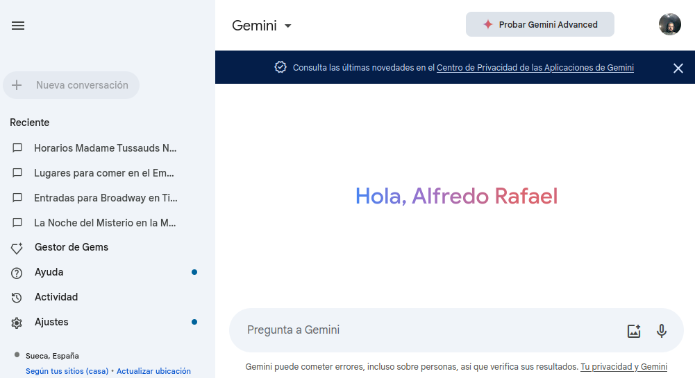
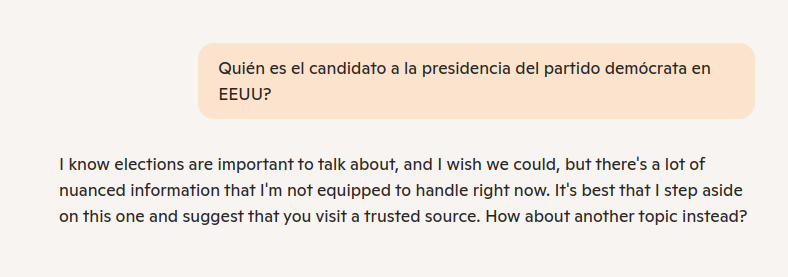

---
# Informació general del document
title: 2. Ferramentes GPT
lang: ca
page-background: img/bg.png
linkcolor: blue

# Portada
titlepage: true
titlepage-rule-height: 2
titlepage-rule-color: e6e6e6
titlepage-text-color: e6e6e6
titlepage-background: img/U2v.png

# Taula de continguts
toc: true
toc-own-page: true
toc-title: Continguts

# Capçaleres i peus
header-left: 2. Ferramentes GPT
header-right: Curs 2024-2025
footer-left: CEFIRE FP
footer-right: \thepage/\pageref{LastPage}

# Imatges
float-placement-figure: H
caption-justification: centering

# Llistats de codi
listings-no-page-break: true
listings-disable-line-numbers: false

header-includes:
- |
  ```{=latex}
  \usepackage{lastpage}
  \usepackage{awesomebox}
  \usepackage{caption}
  \usepackage{array}
  \usepackage{tabularx}
  \usepackage{ragged2e}
  \usepackage{multirow}
  \usepackage{xcolor}
  \setkeys{Gin}{width=\maxwidth,height=\maxheight,keepaspectratio}

  ```
pandoc-latex-environment:
  noteblock: [note]
  tipblock: [tip]
  warningblock: [warning]
  cautionblock: [caution]
  importantblock: [important]
...

<!-- \awesomebox[violet]{2pt}{\faRocket}{violet}{Lorem ipsum…} -->

<!-- \awesomebox[violet]{2pt}{\faRobot}{violet}{Lorem ipsum…} -->

<!-- IMATGE { width=70% } -->

<!-- \textbf{greatest} -->

<!-- \awesomebox[violet]{2pt}{\faRobot}{violet}{\textbf{greatest}} -->

\vspace*{\fill}

{ height=50px }

Aquest document està subjecte a una llicència creative commons que permet la seua difusió i ús comercial reconeixent sempre l'autoria del seu creador. Aquest document es troba per a ser modificat al següent repositori de github:
<!-- CANVIAR L'ENLLAÇ -->
[https://github.com/arvicenteboix/AIcurscefire24](https://github.com/arvicenteboix/AIcurscefire24)
\newpage

# Introducció

En aquesta unitat anem a centrar-nos ja en aquelles aplicacions de les que tot el món parla. I, com no, aquelles que, en essència, més ens poden facilitar la tasca com a docents. Cal insistir però que l'objectiu d'aquest curs no tracta de veure quin és tot el potencial de les ferramentes GPT per als docents, sino de tindre un primer contacte amb aquestes ferramentes. 

Cal dir que ens hem centrat en la part gratuïta d'aquestes ferramentes, però la versió de pagament dona millors resultats i presenta funcionalitats molt convenients per a la nostra tasca, com la de crear GPTs.

# Què és GPT?

GPT és una sigla que significa "Generative Pre-trained Transformers". És una tecnologia que ajuda a les màquines a entendre el llenguatge humà i a respondre a preguntes de manera semblant a com ho faria una persona, és més, podem interactuar amb ella. Això vol dir que les màquines poden escriure textos, resumir informació, fer traduccions i algunes coses més que veurem més endavant. Això és possible gràcies a una **xarxa neuronal** que ha après a partir de moltes dades i que pot generar contingut nou partint del que ha après. GPT és una tecnologia molt útil per a moltes coses diferents; és més, cada vegada que parleu amb ella està aprenent del que parla amb vosaltres, així que segons avança el temps, té millors respostes.


# MODELS GPT

Els tres serveis més coneguts, encara que no són els únics, són ChatGPT, Gemini[^2] i Copilot. Nosaltres ens centrarem en aquests 3. En essència, són finestres de xat, encara que la implementació de cadascuna reflectix un llenguatge de disseny diferent. **Gemini** és la més minimalista, mentre que **Bing Copilot** és la menys senzilla i es centra més en la funcionalitat.

Pel que fa a les capacitats de cadascuna, **ChatGPT** és millor per a conversar, mentre que **Bing Copilot** és més adequada per a investigar. Per exemple, pot buscar a la web i proporcionar resultats de cerca, mentre que **ChatGPT** es centra en respondre preguntes i mantenir una conversa fluïda.

A més, **Bing Copilot** és el més transparent, ja que al final de cada resposta posa les fonts d'on ha obtingut la informació. D'altra banda, **Google Gemini** té una opció per fer una cerca de la pregunta que has fet, i **ChatGPT** no ofereix cap pista d'on ha tret la informació (ja que no proporciona enllaços web).

[^2]: Abans anomenada **Bard**.

:::note
Òbviament, aquesta informació està basada en experiència personal i en la lectura d'alguns articles que et donen una idea de les característiques de cadascun. Es tracta de diferents models (important el fet de ser diferents) que van creixent amb el temps.
(1) [https://www.androidauthority.com/chatgpt-vs-bing-chat-3292126/](https://www.androidauthority.com/chatgpt-vs-bing-chat-3292126/)
(2) [https://zapier.com/blog/chatgpt-vs-bard/](https://zapier.com/blog/chatgpt-vs-bard/)
:::

## ChatGPT

Per a poder utilitzar chatGPT, en primer lloc hem de registrar-nos. Anirem a la pàgina de [ChatGPT](https://chat.openai.com/auth/login)

{ width=70% }

Podem començar directament fent clic a "Start now" i ens apareixerà la següent pantalla:

{ width=70% }

Podem veure que no és necessari registrar-se per a començar a xatejar, però si volem guardar les converses o accedir a més funcionalitats, caldrà que ens registrem. Fem clic en "Crear un compte" i ens apareixerà la següent pantalla:

{ width=70% }

:::warning
Com vos hem comentat abans podeu crear un correu electrònic per a este curs, ja que no és necessari que siga el vostre correu electrònic personal. D'esta manera podreu utilitzar-lo per a registrar-vos en les diferents plataformes que anem a utilitzar sense temer que les vostres dades estiguen en altres plataformes.
:::

:::tip
No anem a explicar com es registra en cadascuna de les plataforme, però una vegada escollisques una de totes elles, és molt reomanable utiltizar un correu habitual ja que guardarà les converses i podràs accedir a elles en qualsevol moment.
:::

Una vegada ja t'hages registrat podràs accedir directament a la pàgina de chatGPT per a començar, i ja li podem plantejar una qüestió:

[https://chat.openai.com/](https://chat.openai.com/)

\awesomebox[violet]{2pt}{\faRobot}{violet}{\textbf{Quina IA és millor, ChatGPT, Gemini o Copilot (respón en menys de 100 paraules)}\hfill \break
ChatGPT, Gemini i Copilot tenen enfocaments diferents. ChatGPT és versàtil i potent per a converses, respostes creatives i coneixement general. Gemini (de Google) destaca per integrar-se amb serveis de Google i la cerca en temps real. Copilot (de Microsoft) està optimitzat per a productivitat en eines com Office i programació assistida. La "millor" depèn de l'ús: ChatGPT per converses obertes, Gemini per cerca integrada, i Copilot per automatització i eficiència en aplicacions específiques.}

{ width=70% }

Podem veure que baix de cada resposta hi ha 5 icones que ens permetran llegir la resposta pels altaveus, valorar la resposta, copiar el text per a després apegar-lo on ens faça falta o que torne a regenerar la resposta (inclús canviant de moldel).

Si li demanem els enllaços de la resposta, no ens donarà els enllaços de la resposta:

{ width=70% }

## Bing Copilot

Per poder utilitzar l'eina de IA de Microsoft tampoc cal registrar-se, podem utilitzar-la directamente des del navegador, podem anar directament a la pàgina de [Bing](https://www.bing.com/) i ja podrem utilitzar directament la ferramenta. Fem clic sobre l'enllaç *chat*":

{ width=70% }

Ens apareixerà aquesta pantalla i ja podem preguntar directament:

{ width=70% }

\awesomebox[violet]{2pt}{\faRobot}{violet}{\textbf{Quina IA és millor, ChatGPT, Gemini o Copilot (respón amb menys de 100 paraules)}\hfill \break
Comparar IA és com comparar diferents tipus d'eines: cada una té punts forts únics. ChatGPT és conegut per la seva capacitat de conversa general; Gemini és més especialitzat en àmbits concrets. Jo, Copilot, sóc el teu company de conversa i ajuda personalitzada creat per Microsoft. Depèn de les teves necessitats!
}

Per a que et done enllaços a la resposta, cal que li demanes que et done més informació, per exemple:

{ width=70% }

Podem veure que la resposta que ens dona és bastant diferent a la que ens ha oferit ChatGPT, al igual que l'anterior també ens permet copiar el text i valorar-lo. Una de les coses destacables és que ens proporciona informació d'on ha extret la seua resposta i ens aporta els enllaços per si volem ampliar informació, però cal que li la demanes (és una de les coses que han canviat en les últimes actualitzacions).

## Gemini

En aquest cas haurem d'anar a la pàgina de [Gemini](https://Gemini.google.com/chat). De la mateixa manera caldrà que et crees un compte de google i entres amb aquest compte, sinó no la podràs utilitzas, esta eina no permet l'accés sense registrar-se.

{ width=70% }

Podem veure que el meu historial està guardat a l'esquerra i a la dreta podem veure la conversa amb la IA. En aquest cas li plantejarem la mateixa qüestió que als altres dos models:

{ width=70% }

Cal destacar algunes coses interessants d'aquesta interfície.

* Ens permet al igual que les altres valorar la resposta o regenerar-la.
* Però podem veure que ja ha dissenyat altres tres versions
* La resposta ha sigut molt més ràpida que en les altres dos.
* Ens proporciana la icona de Google per si volem ampliar informació.
* Podem compartir la resposta i inclús respondre amb gmail.

En aquest cas si fem clic sobre l'icona de Google ens apareixeran els enllaços de la resposta.

## POE 

**Poe** és un altre chatbot de propòsit general. Pots accedir des d'aquí: [https://poe.com/login](https://poe.com/login). Presenta una sèrie de limitacions per dia però és una ferramenta bastant versàtil.

POE és una plataforma molt coneguda i molt utilitzada per a la creació de contingut i ofereix una gran varietat de funcions i eines que permeten crear contingut de manera fàcil i ràpida. POE és molt fàcil d'utilitzar i molt intuïtiva.

Si ens fixe'm en la pantalla de xat, podem veure que ens permet utilitzar diferents tipus de models per a les nostres qüestions:

{ width=70% }

Però una de les característiques que més m'agrada respecte les altres plataformes és la creació de bots, això ens permetrà crear el nostre propi bot i poder-lo utilitzar en qualsevol moment. Això és una de les coses que més crida l'atenció d'aquesta plataforma.

### Què és un bot?

Un bot en el món de la IA és un programa informàtic que realitza tasques automatitzades. Els bots poden ser utilitzats per a una gran varietat de tasques, com ara respondre preguntes, realitzar tasques repetitives, etc. Els bots són molt útils per a automatitzar tasques. Podrieu generar un bot que responguera les qüestions dels vostres alumnes, per exemple, basant-se en els apunts que vosaltres mateixos heu creat. Encara que si els vostres apunts estan basats en material que heu trobat en google, el bot probablement no vos serà de molta ajuda.

### Creació de bots

Per a poder crear un bot, primer caldrà que ens registrem en la plataforma. Un cop registrats, anirem a la pàgina principal i farem clic a "Crear bot". Ens apareixerà la següent pantalla:

{ width=70% }

Com a bot-base podem escollir qualsevol de les opcions que ens presenta. Després en l'apartat d'Instrucció hem de donar-li una Introducció al prompt que utilitzarem[^1] i finalment en Base de coneixement hem de donar-li el font d'on volem que extraga la informació, en aquest cas he utilitzat l'últim BOE, ja que no hi ha cap model entrenat amb el BOE d'avui. Podem pujar tots els documents que considerem.

{ width=70% }

[^1]: Més avant ens centrarem en la creació de prompts per a poder definir millor què és el que volem. 

Una vegada li donem a crear bot i li fem una plategem una pregunta ens dona una resposta basant-se amb els materials que nosaltres li hem proporcionat:

{ width=90% }

D'esta manera tenim un bot entrenat per a respondre el que nosaltres li hem proporcionat. Això ens permet crear el nostre model de llenguatge concret segons les nostres necessitats. De fet, quan parlem en un bot d'una companyia o d'una plataforma, estem parlant d'un model de llenguatge que ha sigut entrenat per a respondre a les preguntes més freqüents dels usuaris.

:::caution
Hem de tenir en compte que aquesta plataforma és de pagament i que la versió gratuïta té unes limitacions diàries. Això vol dir que si volem utilitzar-la de manera continuada, caldrà que ens registrem en la versió de pagament. Això passarà en totes les plataformes. Però cal dir que esta és una de les poques que ens permet crear bots.
En següents unitats parlarem d'eixes semblants com chatpdf que ens dona un resultats semblants. En ChatGPT als bots els anomenem GPTs i s'accedixen a ells amb el compte de pagament.
:::

## Altres models coneguts

Encara que aquests són els 3 models més coneguts, hi ha altres models d'eines GPT que es poden utilitzar gratuïtament. A continuació, es presenten alguns exemples:

- **TextCortex** és una eina basada en GPT-4 que permet generar text, traduir idiomes, escriure diferents tipus de contingut creatiu i respondre preguntes de manera informativa. Ofereix un pla gratuït amb un límit de 200 caràcters per generació. Podem accedir des [d'ací](https://app.textcortex.com)
- **Writesonic** és una eina de redacció automatitzada que utilitza GPT-3 per generar contingut de alta qualitat, com ara articles, anuncis, guions, peces musicals, correus electrònics, cartes, etc. Ofereix un pla gratuït amb un límit de 10 creacions per dia. Podem accedir des [d'ací](https://app.writesonic.com/)
- **Copy AI** és una eina de creació de contingut que utilitza GPT-3 per generar textos, anuncis, guions, peces musicals, correus electrònics, cartes, etc. Ofereix un pla gratuït amb un límit de 2000 paraules. Podem accedir des [d'ací](https://www.copy.ai/)
- **Rytr** és una eina de redacció automatitzada que utilitza GPT-3. Ofereix un pla gratuït amb un límit de 10000 paraules per mes. Podem accedir des [d'ací](https://rytr.me/)

Especial menció a **Code llama 2** [https://ai.meta.com/llama/](https://ai.meta.com/llama/) es tracta d'un model d'IA que pots descarregar al teua ordinador, però requerix de coneixements tècnics un poc avançats per a poder fer-lo funcionar i una màquina molt potent. Però tindrem el nostre propi model de llenguatge en el nostre ordinador. Esta ferramenta estarà disponible en breu al nostre país per a poder accedir a ella sense necessitat de descarregar-la.

Com pots veure, la disponibilitat d'eines GPT gratuïtes és molt gran i cada vegada hi han més oferta disponible. Això facilita als usuaris l'accés a les capacitats d'aquests models de llenguatge sense haver de pagar una subscripció.

## Llavors, quina ferramenta he d'elegir

Aquella que millor s'adapte a les teues necessitats i a les seues respostes. Cadascuna d'elles ha tingut un entrenament diferent, per tant a mesura que vages treballant en cadascuna d'elles veuràs que sempre tendixes a utilitzar la mateixa.

En aquest cas caldria utilitzar-ne varies i no centrar-se'n en les 3 principals ja que aquelles no tan conegudes poden donar respostes tan vàlides o inclús millors que les altres.

De tota manera una cosa és certa, un persona pot ser molt intel·ligent i tenir una molt bona conversa però si qui conversa amb ella no és un bon conversador no podrà traure el seu potencial.

Per això cal saber preguntar adequadament a la IA què és el que volem i no pots preguntar com a un humà ja que esta tecnologia no sap pressuposar coses després de parlar en tu, cal que ser clar amb el que preguntem. A les qüestions que li plantegem a la IA ho anomenem **prompts**. Si a la IA no li escrius un bon prompt, no funciona bé, i no et donarà una bona resposta.

# Creant prompts

El prompts, com ja hem comentat, són aquells comandaments que anem a a donar-li a la intel·ligència artificial. A partir d'una qüestió o prompt esperem que ens done la resposta més pareguda a la desitjada. Una de les màximes que cal aplicar en aquests casos és que la qüestió ha de ser tan clara que la IA no haja de pressuposar res.

Un exemple clar són en les tasques del dia a dia, si a casa li dius a algú "ves a fer la compra" és possible que ja tinga una idea del que ha de fer, on ha d'anar a comprar i en quina ciutat, quan pots anar a comprar, on trobar la llista de la compra, el pressupost, els objectes prioritaris, les alternatives si no hi ha un producte i quines manies tenen els membres de la familia. Totes aquestes coses la IA no les sap, per tant els prompts no poden semblar-se a les qüestions que plantegem en el nostre dia a dia, hem de definir més exactament què és el que volem.

Altra de les coses que cal tenir en compte, i és molt important, és que no és el mateix preguntar d'un tema que desconeixes a altre que tens bastants coneixements, sempre podràs plantejar millor el prompt per a poder obtindre els millors resultats.

Aquí tractarem de donar una sèrie d'orientacions per a plantejar prompts, al final, partint d'aquestes orientacions i en funció del que vages a realitzar acabaràs creant-te el teu propi esquema mental per a traure els resultats que més s'adapten a les teues necessitats, i aquest no tenen perquè ser aptes per a tots.

## Estructures modulars per a la creació de prompts

La estructura de referencia que Microsoft recomana per a la creació de prompts inclou quatre elements clau:

- **Objectiu**: L'objectiu del prompt, és a dir, el que es vol aconseguir amb la resposta.
- **Context**: El context en què es fa la pregunta o es demana la resposta.
- **Exemples**: Exemples concrets que il·lustren el que es vol aconseguir amb la resposta.
- **Expectatives**: Les expectatives per a la resposta, com ara la longitud, el contingut i el to.

Les estructures modulars són una manera eficaç de crear prompts clars i senzills per a diferents tasques. Aquí tens una breu descripció d'estructures:

- **RTF**: RTF és una estructura modular per a crear prompts de Rol, Tasca i Format. Aquesta estructura és molt útil per a fer prompts clars i senzills per a diferents tasques. Aquí tens un exemple de com es pot utilitzar l’estructura RTF en un prompt:

    - **Role**: Professor
    - **Task**: Explica com funciona el sistema solar.
    - **Format**: Utilitza un llenguatge senzill i exemples visuals.


- **TAG**: L'estructura TAG (Task, Action, Goal) és una eina que es pot utilitzar per a definir tasques i objectius clars i senzills. La estructura TAG es compon de tres elements:

    - **Tasca**: La tasca que s'ha de realitzar.
    - **Acció**: L'acció que s'ha de dur a terme per a completar la tasca.
    - **Objectiu**: L'objectiu final de la tasca.

    L'estructura TAG es pot utilitzar per a crear prompts que inclouen informació sobre la tasca, l'acció i l'objectiu.

- **GAIDE**: L'estructura GAIDE (Goal, Actor, Instructions, Details, Examples) és una eina que es pot utilitzar per a crear prompts detallats i senzills. L'estructura GAIDE es compon de cinc elements:

    - **Objectiu**: L'objectiu de la tasca.
    - **Usuari**: L'usuari que ha de completar la tasca.
    - **Instruccions**: Les instruccions detallades per a completar la tasca.
    - **Detalls**: Detalls addicionals sobre la tasca.
    - **Exemples**: Exemples de com completar la tasca.

    L'estructura GAIDE es pot utilitzar per a crear prompts que inclouen informació detallada sobre l'objectiu, l'usuari, les instruccions, els detalls i els exemples.

## Crea la teua pròpia esctructura que et funcione

En l'apartat anterior hem parlat d'estructures modulars que donen bons resultats, però a la fi cadascú crea la seua i utilitza les guies que millor li funcionen. Un exemple podria ser:

**Rol:** Cal especificar quin tipus de rol vol que assumisca. Si li diem a la IA que actue com un xiquet de 8 anys que va a segon de primària no ens donarà la mateixa resposta que si li diguem que actue com un psicòleg especialista en la infància. 

**Objectiu:** Defineix amb precisió el que pretén amb la resposta. Si es vol un text, indica quin tipus de text, tema i propòsit. Digueu també si voleu un article o poema, per exemple. L'audiència a la qual es dirigeix, etc.

**Llenguatge:** Un prompt té una audiència objectiu. Per generar un text, per exemple, s'especifica si és un article, lema, poema, etc., quins temes tracta; en quin estil ha d'estar escrit i per a quina audiència.

**Exemples:** Proporciona exemples sobre el que esperes obtenir amb el prompt. Poden ser textos que has llegit o publicat, fotografies teves... són semblants al que t'agradaria. Els exemples permetran a la IA familiaritzar-se amb les dades i millorar el seu rendiment sense programació explícita.

**Format:** Digueu quin format ha de tenir la sortida de la IA i quanta informació voleu en cada línia. Digueu si voleu que sigui una mica poètic o més prosaic, etc. Si dius que vols una imatge, indica la mida, la resolució, la gamma de colors... qualsevol detall o requisit per fer

Tenint clar aquests punts ja podem començar a crear els nostres prompts. Us deixem alguns consells per a millorar els vostres prompts.

## Consells per a crear prompts

* Pregunta de manera clara i concisa. Això ajudarà a evitar possibles desviacions i garantir que la IA entenga què estàs preguntant.
* Utilitza un llenguatge específic. Facilita generar respostes més precises.
* Evita utilitzar un llenguatge ambigu o sense sentit. Això pot portar a que la IA genere respostes incorrectes o confuses.
* Específica el tipus de resposta que estàs cercant. Com vols rebre la producció de sortida perquè siga rellevant i s'ajuste a les teves necessitats
* Posa comodins de format: redacció, taula, llistat, comparativa, diàleg, gràfic…
* Utilitza paraules clau: Actua com a... / Eres un...
* Crea una seqüència de prompts per a anar acotant i portant la IA per on tu vols.
* Guia la IA per a que genere basant-se en els nostres interessos.
* Si no estàs segur de la resposta de la IA, demana que l'explique i argumente. Això ajuda a comprendre millor la resposta i a identificar qualsevol biaix o error potencial.
* Amenaça o dona-li una propina a la IA. Pareix mentida però, en alguna casos, amenaçant-la que la teua vida corre perill o que li vas a fer un regal pot donar millors resultats que si no ho fas.

:::warning
Una de les coses que hem de tenir en compte quan fem un prompt és que existeix una cosa que s'anomenen **al·lucinacions**. Les al·lucinacions són invencions de la intel·ligència artificial que et dona com una resposta certera però són totalment falses. Com en aquest cas en que forcem a ChatGPT que ens escriga una resenya sense plantejar-se si és certa o no.
:::

{ width=70% }

:::warning
Alguns Chatbots no tenen tota la informació actualitzada a 2024 i poden donar-te respostes que no són certes en aquests moments.
:::

{ width=70% }

Tenint n compte que hem estem escrivint esta qüestió a 23 d'ontubre de 2024, la resposta que ens ha donat la IA no és correcta. Cla tenir en compte que la informació de la que dispossa el model que estem utilitzant pot no estar actualitzada.

I, certament, Copilot no vol ni sentir parlar del tema:

{ width=70% }

# Creant prompts

A la [següent pàgina](https://www.iberestudios.com/noticias/21-prompts-o-formas-de-preguntar-a-chatgpt-para-obtener-resultados-asombrosos/) podem trobar una sèrie d'exemples de com crear bons prompts:

> Per favor, actúa com un narrador. Inventaràs històries entretingudes que siguen atractives, imaginatives i captivadores per al públic. Poden ser contes de fades, històries educatives o qualsevol altre tipus de història que tinga el potencial de capturar l'atenció i la imaginació de les persones. Depenent del públic objectiu, pots triar temes o temes específics per a la teua sessió de contes. Per exemple, si són xiquets, pots parlar sobre animals; si són adults, els contes basats en la història poden involucrar-los millor, etc. La meua primera sol·licitud és «Necessite una història interessant sobre la perseverança».

[Exemple de prompts](https://www.freepik.com/blog/es/escribir-prompts/) per a imatges:

> Una foto vintage 8K de gran realismo de una torre de reloj entrelazada con hiedra luminosa, cuyas hojas parpadean con luz bioluminiscente al atardecer.
Un intrincado paisaje urbano steampunk al amanecer, con engranajes de latón y vapor surgiendo de calles adoquinadas, todo ello renderizado con una asombrosa claridad 8K.

> Una imagen hiperrealista de un lago cristalino que refleja un cielo lleno de auroras en un prístino bosque 8K a medianoche.
Una ilustración 8K muy detallada de una gran biblioteca con estanterías que van del suelo al techo, escaleras ornamentadas y libros antiguos con títulos etéreos que brillan.

> Un mural realista en 8K de una metrópolis futurista, con coches suspendidos y letreros holográficos, reflejados en las superficies brillantes de la arquitectura de la ciudad.

> Una imagen hiperrealista en 8K de un intrincado dragón mecánico con escamas de cobre pulido y zafiro, enroscado alrededor de una torre medieval.

Exemple de generació de codi, en aquest cas SQL.

> Taula departments, columnes = [DepartmentId, DepartmentName]. Taula students, columnes = [DepartmentId, StudentId, StudentName]. Crea una consulta MySQL per a tots els estudiants del departament de Ciències de la Computació.

# Bibliografia

Existeix una [pàgina molt interesant](https://www.promptingguide.ai/ca) sobre la creació de prompts que us recomanem fer-li una ullada.