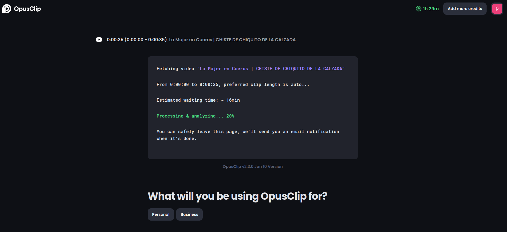
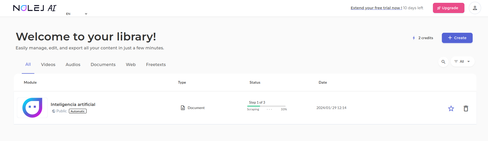
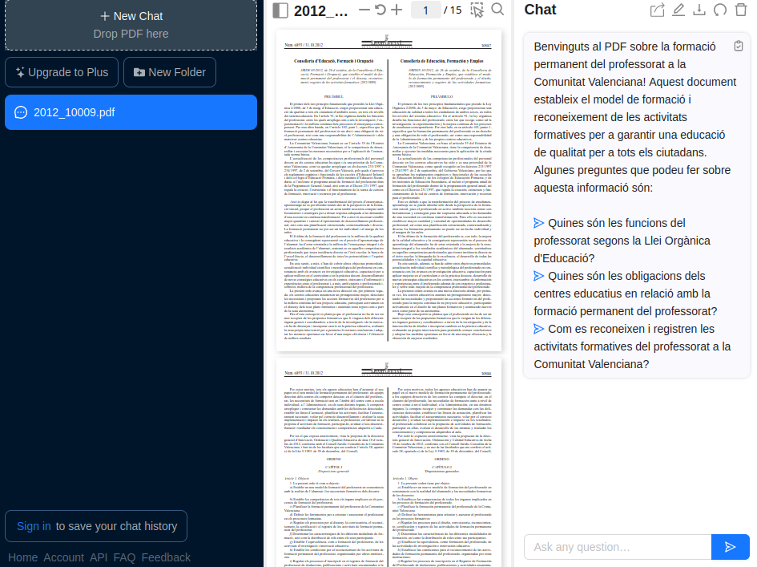

---
# Información general del documento
title: 3. Creación multimedia con IA
lang: can
page-background: img/bg.png

# Portada
titlepage: true
titlepage-rule-height: 2
titlepage-rule-color: AA0000
titlepage-texto-color: AA0000
titlepage-background: U3.png

# Tabla de contenidos
toque: true
toque-own-page: true
toque-title: Contenidos

# Cabeceras y pies
header-left: 3. Creación multimedia con IA
header-right: Curso 2023-2024
footer-left: CEFIRE Valencia
footer-right: \thepage/\pageref{LastPage}

# Imágenes
float-placement-figuro: H
caption-justification: centering

# Listados de código
listings-no-page-break: true
listings-disable-line-numbers: false

header-includes:
- |
  ```{=latex}
  \usepackage{lastpage}
  \usepackage{awesomebox}
  \usepackage{caption}
  \usepackage{array}
  \usepackage{tabularx}
  \usepackage{ragged2e}
  \usepackage{multirow}
  \usepackage{xcolor}

  ```
pandoc-latex-environment:
  noteblock: [note]
  tipblock: [tip]
  warningblock: [warning]
  cautionblock: [caution]
  importantblock: [important]
...

<!-- \awesomebox[violet]{2pt}{\faRocket}{violet}{Lorem ipsum…} -->

<!-- \awesomebox[violet]{2pt}{\faRobot}{violet}{Lorem ipsum…} -->

<!-- IMATGE { width=10cm } -->

<!-- \textbf{greatest} -->

<!-- \awesomebox[violet]{2pt}{\faRobot}{violet}{\textbf{greatest}\hfill \break} -->

\vspace{\fill}

{ height=50px }

Este documento está sujeto a una licencia creative commons que permite su difusión y uso comercial reconociendo siempre la autoría de su creador. Este documento se encuentra para ser modificado en el siguiente repositorio de github:
<!-- CANVIAR L'ENLLAÇ -->
[https://github.com/arvicenteboix/AIcurscefire](https://github.com/arvicenteboix/AIcurscefire)
\newpage


# Introducción

Hasta ahora hemos visto algunas herramientas GPT, pero en la red podemos encontrar muchas mas aplicaciones que hacen uso de la inteligencia artificial para crear casi cualquier producto multimedia. En este módulo os plantearemos algunas herramientas que os pueden ser de utilidad en vuestro día a día. Pero como bien sabréis, son unas cuántas de ejemplo. Estoy seguro que vosotros conoceréis muchas más y que serán tan útiles como las planteadas aquí.

:::warning
Es recomendable que os creéis un correo aleatorio para poder inscribirse en cada una de las plataformas para probar así todas las herramientas sin necesidad de tener que usar vuestro correo personal. Si alguna os interesa mucho sí que lo podríais utilizar para estar informado de las novedades.
:::

# Buscadores que utilizan inteligencia artificial

Ya hemos comentado en el módulo 1 la diferencia entre algoritmo y red neuronal, básicamente un algoritmo es una secuencia lógica de pasos que permite solucionar un problema mediante operaciones matemáticas no-ambiguas, mientras que una red neuronal es un sistema que puede aprender y modificarse a sí misma. Los buscadores más conocidos, a pesar de que poco a poco van introduciendo redes neuronales están basados principalmente en algoritmos de búsqueda. Pero existen otro tipo de buscadores que nos pueden facilitar más nuestra búsqueda por Internet. Aquí os damos dos ejemplos:

## Perplexity

Perplexity tiene un entorno similar a los bots conversacionales pero este está centrado en la búsqueda de información y siempre partiendo de unas fuentes, que bien buscará él o podrás proporcionar tú. Podemos acceder desde aquí:

[http://www.perplexity.ai](http://www.perplexity.ai)

:::info
Como en todas las plataformas habrá que acceder con una cuenta de Google o hacer el registro en la página. 
:::

Aquí tenéis un ejemplo que ilustra un poco lo que estamos comentando. Si le preguntamos a Perplexity:

\awesomebox[violet]{2pt}{\faRobot}{violet}{\textbf{Qué centro de la comunidad valenciana ha sacado las mejores notas en las pruebas EBAU en el 2023}\hfill \break
Podemos ver que las respuestas que nos da difieren de si le doy un contexto o no} 

{ width=10cm }

:::caution
Fijaos que coge unas referencias que él considera óptimas, pero no son las ideales.
:::

{ width=10cm }

:::important
Las respuestas dadas no son una verdad absoluta, les tenemos que dar un contexto. En este caso nos da unos resultados basados en unas medias numéricas que es el contexto que ha considerado el diario como mejor o peor. Hace falta siempre tener una capacidad de valoración para saber el tipo de respuesta que tenemos.
:::

Si hacemos una cuestión más general, entenderemos porqué esta herramienta está orientada más en la búsqueda de información:

{ width=10cm }

Probablemente otro chatbot como chatgpt ya nos habría dado algún ejemplo sobre alguna receta de cocina.

:::tip
Como veis cada IA tiene un propósito específico. Por eso es importante en que no os quedéis solo en una y que vayáis investigando diferentes versiones de todas ellas. También dependerás de las necesidades que se tenga en cada momento para utilizar una u otra.
:::

## You

Podemos encontrar el buscador you en la [siguiente página](https://you.com/). Al igual que Perplexity, You también es una IA centrada en la búsqueda de información, las respuestas que nos da son más naturales pero no nos da las referencias de dónde ha sacado la información. Fijémonos qué respuesta nos da a la misma cuestión plateada a Perplexity:

{ width=10cm }

:::note
Si analizamos la respuesta veremos que nos da un resultado bastante diferente del que esperábamos, por eso es importante leer la respuesta puesto que podemos ver que nos dice claramente *han llegado a la selectividad con la mejor nota mediana de toda la Comunidad Valenciana al 2023*. Y no está hablando concretamente de la nota media después sino de antes.
:::

# Creación de imágenes y videos

## Flexclip

Se trata de una herramienta para crear y editar videos, esta presenta una parte donde puedes generar vídeos a partir de texto. Hay que ser muy específicos con lo que se desea puesto que los resultados no son nunca los que uno está pensando. Podemos acceder desde [aquí](https://www.flexclip.com)

Para crear un video a partir de texto tenemos que ir a la herramienta AI Video Generator:

{ width=10cm }

Y escribimos un prompt:

{ width=10cm }

:::note
Se trata de una herramienta de pago como casi todas las que vamos a ver, estas nos permiten crear una serie de archivos multimedia en el día. Así que hay que tener en cuenta estas limitaciones. Flexclip, también es un editor de video online muy potente.
:::

## Deepai

Podemos acceder a Deepai desde [aquí](https://deepai.org). Se trata de un generador de imágenes. Podemos ver que como todas las IA hay que dar un contexto más amplio para tener un resultado más deseado:

{ width=10cm }

:::caution
Nosotros estamos planteando un prompt en valenciano, siempre dará mejor resultado aquellos que expresamos en inglés. Generar imágenes a partir de IA es un tanto más complejo y requiere de especificar claramente lo que queremos sin dar lugar a dudas, siempre podemos modificar el prompt para ir buscando el resultado esperado. Dos cosas que hay que tener en cuenta cuando se crea un prompt de imagen es que la primera frase es más importante que la última. Fijaos cómo yo quiero que aparezcan los dos alumnos y cambio el prompt para insistir.
Recordad que las órdenes que recibe la inteligencia artificial tienen que ser claras y directas. Olvidémonos de la educación, no es necesaria!
:::

{ width=10cm }

Esta herramienta permite crear tantas imágenes como queramos y es bastante útil si te adaptas a sus gustos[^1]

[^1]: cuando hablamos de gustos hablamos de la manera que está entrenada la IA.


## Canva

Canva es una herramienta que muchos utilizamos para generar nuestras creaciones. En el apartado de Apps podemos encontrar muchas herramientas que hacen uso de la IA para generar imágenes. Para acceder a todas estas herramientas hemos de ir a Apps en el menú derecho de Canva cuando estamos creando una imagen.

{ width=10cm }

:::warning
Como casi todas las herramientas de IA para generar imágenes, estas tienen usos limitados, algunas de las herramientas de Canva te permiten crear 25 imágenes al mes por ejemplo.
::: 

### Animo Style

Con esta App de Canva puedes crear imágenes Anime. Por ejemplo.

\awesomebox[violet]{2pt}{\faRobot}{violet}{\textbf{Genera una profesora con un libro en la mano.
Genera un profesor enfadado con uno regla numerada en la mano}}

{ width=10cm }

### DALL-E

La tecnología DALL-E nos permite crear imágenes a partir de texto. Canva dispone una aplicación con ese nombre limitada a la creación de 25 imágenes al mes.

\awesomebox[violet]{2pt}{\faRobot}{violet}{\textbf{Profesor enseñando a dos alumnos en la playa por la noche las constelaciones}}

{ width=10cm }

### D-ID AI Presenter

Podemos generar audio para las presentaciones pero podemos añadir una persona que habla mientras se hace la presentación. Se tiene que conectar a una plataforma externa y solo permite la creación de 5 minutos.

{ width=10cm }

Hay muchísimas Apps más dentro de Canva que utilizan la IA para facilitarnos la tarea.


## Leonardo

Podemos acceder a Leonardo desde la [siguiente dirección](https://app.leonardo.ai/). Se trata de otra aplicación para crear imágenes que presenta unas funcionalidades bastante interesantes como por ejemplo *Image generation*, se trata de generación de imágenes a partir de texto y *Realtime Canva*.

{ width=10cm }

La funcionalidad de generación de imágenes es bastante interesante, pero la de *Realtime Canva* va a generarnos una imagen a partir de un dibujo que creemos, podemos escanearlo y subirlo o simplemente dibujarlo para que nos haga una interpretación. Se trata de un modelo que generará representaciones artísticas a partir de un concepto más sencillo. Irá generándonos la imagen a partir del dibujo que vayamos dibujando en ese momento:

{ width=10cm }

Es interesante ver que nos permite interactuar tanto en las indicaciones que le damos como texto como en el dibujo que vamos haciendo, de este modo podemos obtener una imagen más ajustada al que buscamos.

:::note
Está bastante optimizada para sacar retratos, así que no os extrañe si siempre os saca imágenes de personas de primer plano.
:::

Freepik es una herramienta con las mismas funcionalidades, podemos encontrarla [aquí](https://www.freepik.com/pikaso#).

## Wepik

Es una herramienta con el mismo propósito que la anterior pero que también funciona por créditos y te permite generar unas 8 imágenes al mes. 

  

Aquí tendríamos un ejemplo de la herramienta de generación de imágenes con Wepik. 


## Bing Copilot

Hemos estado hablando hasta ahora de Bing Copilot como un modelo de lenguaje pero este también trae incorporada la tecnología DALL-E y podemos generar imágenes desde el mismo Chat de Bing Copilot. Este te lleva a la página [https://www.bing.com/images/create?](https://www.bing.com/images/create?) para que te des de alta y ya puedes crear imágenes. Es recomendable tener una cuenta de Outlook[^2] para darse de alta.

[^2]: No es recomendable usar la cuenta corporativa. Como os hemos comentado crearos una cuenta que no vayáis a usar más.

\awesomebox[violet]{2pt}{\faRobot}{violet}{\textbf{Genera una imagen anime de una persona ingeniera que está ante un rack de red y esté quitando un cable de un switch}}


## ¿Qué herramienta escojo?

OpenAI (ChatGPT) y Bard (nombrado recientemente como Gemini) también tienen la tecnología DALL-E implementada en sus chats, aunque OpenAI es de pago, pero la tendencia es que cada vez más y más plataformas implementen estos sistemas de generación de imágenes, los resultados de algunos de ellos pueden ser mejor que otros, siempre dependerá de tu manera de generar el prompt.

:::caution
La IA no ha venido para crearnos todo, sino que nosotros tenemos que saber qué preguntamos y cómo podemos orientarla para sacar los resultados esperados.
:::

Obviamente hay muchas otras opciones interesantes que os invitamos a utilizar como:

* [OpenAI](https://openai.com/dall-e-2/): De pago
* [Lexica](https://lexica.arte/)
* [lipDrop](https://clipdrop.co)
 
# Aplicaciones para dar a conocer la IA en la escuela

Hay muchísimas herramientas que nos permiten ver las posibilidades de la inteligencia artificial y acercarla a nuestros alumnos. Tendemos a quedarnos con las herramientas GPT, pero hay otras muchas posibilidades.

## Replicate

Replicate es una plataforma que te permite utilizar su API[^3] para tus aplicaciones (evidentemente con un coste), te da diferentes modelos de ejemplos, para reconocimiento de imágenes, estilizarlas, crear imágenes más realistas, pero introduce conceptos muy interesantes como el de *negative prompt* que es aquello que no queremos que aparezca en nuestra creación.

[^3]: Una API es una abreviatura de Interfaz de Programación de Aplicaciones. Es un conjunto de definiciones y protocolos que se utilizan para diseñar e integrar el software de las aplicaciones en las tuyas.

Podemos ir a la página de replicate [aquí](https://replicate.com), vamos a probar uno de los modelos como por ejemplo este:

[https://replicate.com/rossjillian/controlnet](https://replicate.com/rossjillian/controlnet)

Este modelo nos permite reconocer fotografías a partir de un esbozo creado por nosotros y crear uno más estilizado, nos permite modificar diferentes parámetros para ver el resultado.


:::caution
El modelo de ejemplo es bastante rápido, pero los otros modelo de ejemplo pueden tardar mucho tiempo para realizar lo que estamos pidiendo. Aun así es una herramienta para entender diferentes conceptos nuevos de la IA, desde los más simples hasta los más avanzados. Si lo utilizáis mucho también os dirá que habéis llegado al límite, pero si cambiáis de navegador podéis continuar, también podéis borrar los datos del navegador para continuar.
:::

## Animated Drawings

Esta plataforma está orientada más a infantil y primaria, y nos permite animar dibujos sencillos que realizamos con nuestros alumnos. El enlace para poder acceder es [este](https://sketch.metademolab.com/).

Nosotros hemos creado la siguiente imagen que subimos al modelo para poder comprobar los resultados:

{ width=5cm }

Nos permite así mismo [compartir](https://sketch.metademolab.com/share/f007a72f87b24dbd9be917d63215cf79/walk_sway) nuestras creaciones. Podemos ver nuestro ejemplo [aquí](https://sketch.metademolab.com/share/f007a72f87b24dbd9be917d63215cf79/walk_sway).

{ width=10cm }

## Teachablemachine

Esta herramienta, como ya hemos comentado en el módulo 1, nos permite entrenar a pequeña escala nuestro modelo de inteligencia artificial para un propósito, por ejemplo el de reconocer objetos, sonidos o posturas. Solo nos hace falta una webcam para hacerlo o unas imágenes ya creadas. Podemos acceder a la plataforma desde [aquí](https://teachablemachine.withgoogle.com/).

{ width=10cm }

Y creamos nuestro primer proyecto:

{ width=10cm }

Nosotros hemos preparado un modelo para distinguir entre un bolígrafo y unas tijeras, subimos las imágenes de cada uno.

{ width=10cm }

Este modelo lo podemos exportar y lo podemos compartir. Obviamente el modelo que he creado no es demasiado interesante, pero podemos entrenar mejores modelos con muchas fotografías, objetos de la clase y crear tu propio reconocedor de objetos. Podéis descargar el modelo de aquí: [https://teachablemachine.withgoogle.com/models/9oqm8e4an/](https://teachablemachine.withgoogle.com/models/9oqm8e4an/)

# Inteligencia artificial vs Inteligencia artificial

A todos nos ha surgido la duda cuando realizamos un trabajo si realmente lo ha creado un alumno o ha hecho uso, ya no sus padres, sino de una herramienta GPT. Existen herramientas, aunque no sean fiables al 100%, para comprobar si un texto ha sido creado con alguna herramienta de inteligencia artificial.

## GPTzero

Se trata de una herramienta bastante interesante para comprobar el texto. Tenemos el enlace [aquí](https://gptzero.me/). Si extraemos un texto de cualquier periódico conocido y lo pasamos por aquí podemos ver el resultado:


De todas maneras los resultados no son 100% fiables y, obviamente, existe [humanizeaitext](https://www.humanizeaitext.org/) o [Quillbot](https://quillbot.com/), que sirve para humanizar más el texto generado por una IA para que resulte menos "artificial" y de esa manera sea más indetectable.

## Quillbot

"Hecha la ley hecha la trampa", también existe la contrapartida de GPTZero. [Quillbot](https://quillbot.com/) es otra herramienta que nos permite modificar el texto para que parezca menos de una IA o simplemente un texto que tengamos y queramos expresarlo de otra manera.


Tenemos otros herramientas para humanizar texto que harán más difícil detectar si el texto ha sido creado por una IA o no, recordad que siempre hay que revisar el material generado puesto que pueden aparecer *alucinaciones* o incluso cambiar el sentido del texto, como hemos podido ver en el ejemplo. Algunos ejemplos son

* **Undetectable AI** [https://undetectable.ai/](https://undetectable.ai/)
* **gpt4detector** [https://gpt4detector.ai](https://gpt4detector.ai)
* **Trinka** [https://www.trinka.ai/es/](https://www.trinka.ai/es/)

# Creación de audio y video

## Studio

A pesar de que también funciona con créditos y permite un límite de creaciones al mes, se trata de una herramienta muy potente. Nos permite crear presentaciones bastante naturales con un avatar o una imagen nuestra diciendo lo que escribimos.

{ width=10cm }

Podemos acceder a la herramienta desde [aquí](https://studio.d-id.com/editor).

:::warning
No penséis que podéis subir la fotografía de un famoso para que diga lo que nosotros queramos, la plataforma lo detecta y no te deja. Si queréis hacer eso como hemos visto con algunos personajes famosos hablando inglés cuando no saben, debes crearte tú el modelo y es una tarea bastante más compleja. Podemos asimismo usar la herramienta que planteamos en el siguiente punto.
:::

[Synthesia](https://www.synthesia.io/), es otra herramienta que nos permitirá igualmente crear presentaciones a partir de un texto, el funcionamiento es muy parecido a Studio.

[HeyGen](https://www.heygen.com/) igualmente nos permite crear presentaciones a partir de texto.

## Rask

Se trata de una herramienta que nos permite traducir un video, nosotros hemos cogido un video de [Eugenio](https://www.youtube.com/shorts/6xq3ay9svha) para escucharlo hablando inglés 

{ width=10cm }

{ width=10cm }

El resultado es bastante sorprendente.

## Opusclip

Es una herramienta que nos muestra las virtudes y los defectos de la IA, nos permite subir un vídeo y nos hace una explicación resumida del video. En este caso subimos un video de un chiste, veremos que no es capaz de detectar la ironía o las gracias del chiste (aunque sean muy malas). Y se lo toma como un vídeo serio. Además le pone subtítulos y lo hace de una manera bastante acertada pese a ser de Chiquito de la calzada. Podemos ver el resultado:

{ width=10cm }

{ width=10cm }

Podemos encontrar la herramienta [aquí](https://www.opus.pro/).

Una herramienta similar es [https://www.you-tldr.com/](https://www.you-tldr.com/), pero esta está especializada en videos de youtube.

## ElevenLabs

Esta herramienta igualmente nos permite convertir texto a audio o un audio a otro audio dándole diferentes entonaciones u otra voz. 

{ width=10cm }

Podemos acceder a la plataforma des [de aquí](https://elevenlabs.io/).

Esto mismo podemos encontrar en la plataforma [https://www.happyscribe.com/](https://www.happyscribe.com/).

## Bing Copilot (complemento Suno)

Con el navegador Bing podemos acceder a Copilot desde el botón situado a la parte superior derecha, pero Copilot también tiene su [propia plataforma](https://copilot.microsoft.com/). Una de las ventajas que resultan más interesantes respecto a las plataformas GPT más conocidas es el uso de complementos de forma gratuita:

{ width=13cm }

Uno de los complementos más interesantes que nos ofrece Copilot es **Suno**, que nos permite crear una canción:

{ width=13cm }

Y podemos compartir el resultado que puedes escuchar [aquí](https://sl.bing.net/bsh2udkcyka).

También podemos ir directamente a la página de [Suno](https://app.suno.ai/) y hacer nuestra creación desde allí.

## Otras aplicaciones multimedia de interés

Existen muchas otras aplicaciones que merece la pena nombrar:

- Albus en [https://albus.org/](https://albus.org/) es una herramienta que compila una base de conocimientos completa de Google Drive, Notion, Jira, HubSpot y 100 aplicaciones más para responder las preguntas de los empleados.
- GitMind en [https://gitmind.com/es/](https://gitmind.com/es/) es una aplicación gratuita de mapas mentales y lluvia de ideas.
- Decktopus en [https://www.decktopus.com/](https://www.decktopus.com/) es una plataforma de presentación que ofrece una amplia gama de temas, fuentes y colores.
- Tome en [https://beta.tome.app/](https://beta.tome.app/) es una herramienta de creación de contenido que ayuda a crear contenido de blog, correos electrónicos y redes sociales.
- SteveAI en [https://www.steve.ai/](https://www.steve.ai/); Gama en [https://gamma.app/](https://gamma.app/); Mixo en [https://www.mixo.io/](https://www.mixo.io/) y SkyBox en [https://skybox.blockadelabs.com/](https://skybox.blockadelabs.com/) son herramientas de creación de contenido que ayuda a crear contenido para redes sociales.
- Microsoft Designer en [https://designer.microsoft.com/](https://designer.microsoft.com/) es una herramienta de diseño gráfico que ayuda a crear diseños profesionales.
- [Simpleshow](https://videos.simpleshow.com) es una herramienta que nos permite crear videotutoriales planteándole un prompt.

## ¿Cuál elegir?

Hoy en día podemos encontrar el uso de la IA prácticamente en cualquier herramienta o dispositivo. Estamos ante una tecnología que ha tenido su boom en los últimos dos años y cada vez va a existir más y más oferta de este tipo de herramientas. Si el uso que le vas a dar es esporádico es recomendable ir usando aquellas que son gratuitas.

# Generación de materiales didácticos

Las siguientes herramientas nos permiten crear materiales de manera rápida y sencilla ya preparados para publicar. 

:::warning
Hay que tener en cuenta que los materiales que se generan están basados en otros materiales que tienen como referencia la IA. Y pueden ser o no adecuados a lo que tú esperas, todo aquello que cree es necesario revisarlo.
:::

## Mindsmith

[Mindsmith](https://www.mindsmith.ai/) es una de las plataformas existentes para crear materiales a modo de presentación:

{ width=10cm }

Le damos un prompt para que nos genere unos materiales generales. Hay que tener en cuenta todo aquello que hemos visto sobre prompts: cuanto más detallado sea el prompt, mejores resultados obtendremos. Además te genera un cuestionario sobre la unidad creada. Os dejamos una unidad de ejemplo creada con Mindsmith:

[https://app.mindsmith.ai/learn/clrxvtgi8009ijn083uor8946](https://app.mindsmith.ai/learn/clrxvtgi8009ijn083uor8946)

:::caution
La plataforma nos limita a la creación de 5 unidades y solo nos deja compartir dos a no ser que paguemos la cuota.
:::

## Nolej

[Nolej](https://nolej.io/nolej-ai-5) es una plataforma que genera automáticamente material de curso interactivo y gráfico basándose en conocimientos generales.




Una de las características más interesantes es que podemos subir un documento (una presentación por ejemplo) y nos creará un cuestionario.

Una herramienta alternativa es la siguiente: [LearningStudioAI](https://learningstudioai.com/) para generar automáticamente preguntas de opción múltiple, de discusión abiertas o «interpretativas» y de debates con las respuestas correspondientes, a partir de documentos adjuntos.

## Schemely

[Schemely](https://schemely.app/) es una plataforma de creación de cursos para profesores, con AI generativa. Es bastante completa y nos permite enlazar la planificación generada con otras herramientas para crear materiales adicionales.

:::info
Cuando nos pide el título del curso pensad que estáis realizando un prompt al modelo, por lo tanto hay de detallar muy bien lo que se pide.
:::


Es interesante ver como ya nos aparecen los enlaces para que nos cree con otras herramientas esa parte del curso.

## TutorAI

[TutorAI](https://www.tutorai.me/) es una aplicación pensada para el autoaprendizaje. Le exponemos un tema y nos dará diferentes módulos para poder aprender.


## MagicSchoolAi

[MagicSchoolAi](https://www.magicschool.ai/) es un conjunto de herramientas agrupadas que nos permite crear materiales para el aula. Una opción interesante es la de crear un cuestionario a partir de una temática. Los cuestionariso de este curso están creados con esta herramienta.


:::note
Al igual que las otras nos da un periodo gratuito de muestra. Pero posteriormente a pesar de que no se puedan utilizar todas las herramientas, las que puedes utilizar son de gran utilidad.
:::

## Otras herramientas

Existen multitud de herramientas. Pero todas ellas parecidas para crear materiales. Os proponemos que echéis un vistazo a otras herramientas como:

### Quizgecko

[Quizgecko](https://quizgecko.com/) es una plataforma de creación de cuestionarios en linea que ayuda nos ayuda a crear cuestionarios interactivos y atractivos para los estudiantes.

### Quillionz

[Quillionz](https://app.quillionz.com/) es una herramienta para generar automáticamente preguntas de opción múltiple, de discusión abiertas o «interpretativas» y de debates a partir de documentos adjuntados. La herramienta tiene una opción gratuita limitada.

### GitMind

[GitMind](https://gitmind.com/es/) es una aplicación gratuita de mapas mentales y lluvia de ideas.

# Otras herramientas interesantes

## ChatPDF

Personalmente [ChaPDF](https://www.chatpdf.com) es una de las aplicaciones que más uso. En este caso se puede subir un PDF y "hablar" con él, puedes hacerle preguntas diversas. En este caso hemos subido la normativa de cursos de CEFIRE. Las respuestas que nos da no son 100% correctas, pero te puede dar una idea, y lo mejor, es que te enlaza la respuesta a la parte del documento donde se habla de ese tema:





## Geospy

[Geospy](https://geospy.web.app/) es una herramienta que nos permite conocer el lugar de dónde es una imagen. Es muy interesante porque te hace un razonamiento de por qué cree que es ese lugar u otro. Muchos pensaréis que utiliza los metadatos de la imagen para saberlo pero dados los razonamientos que te da, te hacen dudar. Los resultados suelen ser bastante certeros, pero en el ejemplo podemos ver que no siempre es fiable (se trata de una fotografía de la superficie de la luna):


## GPT4All

[GPT4All](https://gpt4all.io/index.html) nos permite tener un modelo GPT en nuestro ordenador, eso sí, no esperéis tener un rendimiento como el de la plataforma de ChatGPT, puesto que nuestros ordenadores no son ni de lejos como los que se usan en esas plataformas.

# ¿Y si no encuentro lo que busco?

Aquí hemos tratado de exponeros varias herramientas que utilizan la IA, hay muchísimas, y cada vez existen más y más. Existe una página que va recopilando todas y cada una de ellas. Si no encuentras lo que buscas o quieres alguna alternativa, se puede visitar la siguiente página. Siempre habrá alguna que se adapte a lo que estás buscando.

https://theresanaiforthat.com/

Hay que tener en cuenta que el gran boom de la inteligencia artificial fue en el 2022, cada vez irán existiendo mejores herramientas, más accesibles y más económicas o incluso gratuitas. Estas propuestas que os hemos plateado es para que veáis qué es lo que nos espera en los próximos años, nos vayamos acostumbrando a su uso y las vayáis implementando dentro de vuestra Aula. Solo hace falta que veamos cómo eran los móviles hace 10 años y como son ahora...

Os dejamos para finalizar esta unidad una frase extraída de un artículo que hay que plantear:

> “¿Recuerdan el popular portal 'El rincón del vago'? Pues ni en sus mejores sueños pudieron imaginar los plagiadores la llegada de un instrumento tan eficaz. Fue cuestión de tiempo que universidades americanas y australianas prohibieran el uso de esta herramienta para lograr que sus estudiantes copiasen.
Dado que la historia nos enseña que la evolución tecnológica es casi imposible de contener, hubo visiones que preferían que se afrontara el debate de cómo incorporar el uso de ChatGPT a las aulas y al aprendizaje.
La inteligencia artificial revolucionará, de alguna manera u otra, el papel del profesor. Ahora el conocimiento ya no pertenece exclusivamente al maestro, sino que está por todas partes. Pero evidentemente, el docente es y seguirá siendo la persona adecuada que ayude a los alumnos a interpretarlo."[^4]

[^4]: https://www.eldebate.com/educacion/20230415/chatgpt-educacion-enemigo-aliado-profesores_106508.html