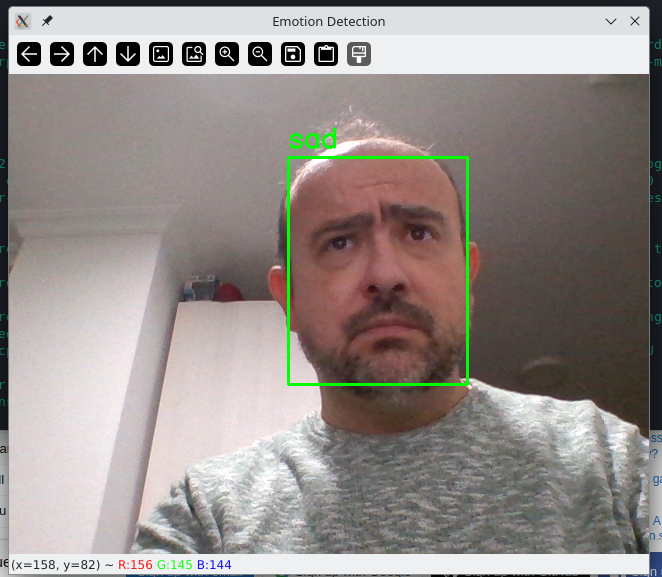
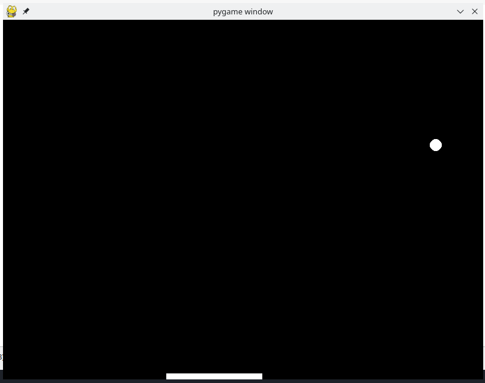
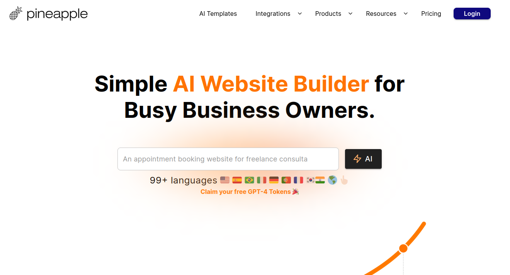
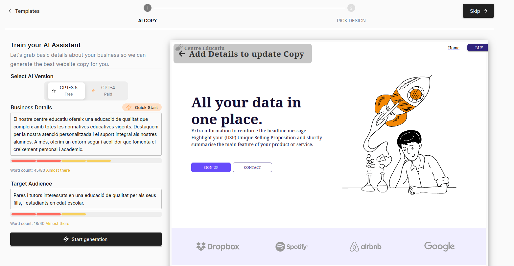
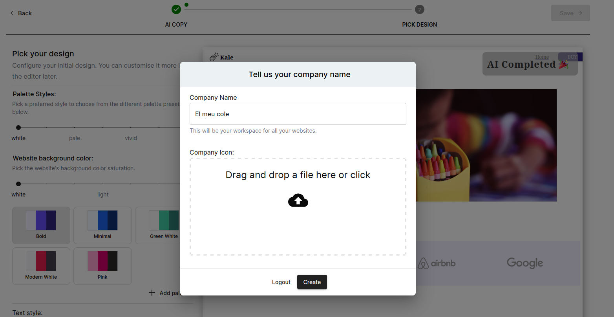
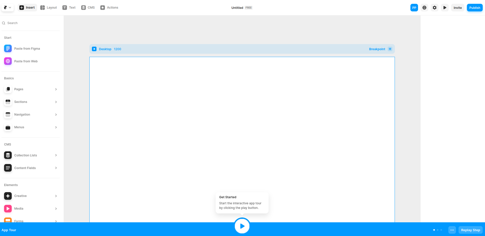
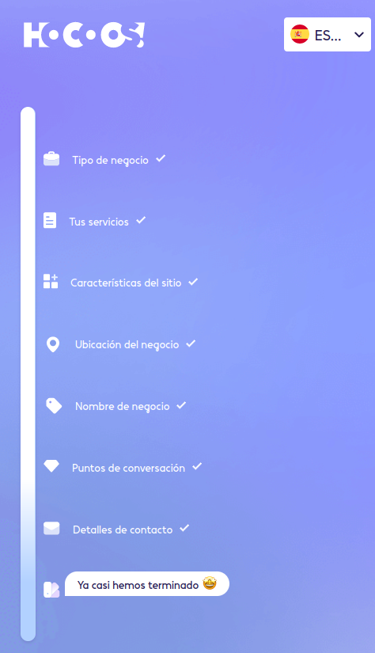
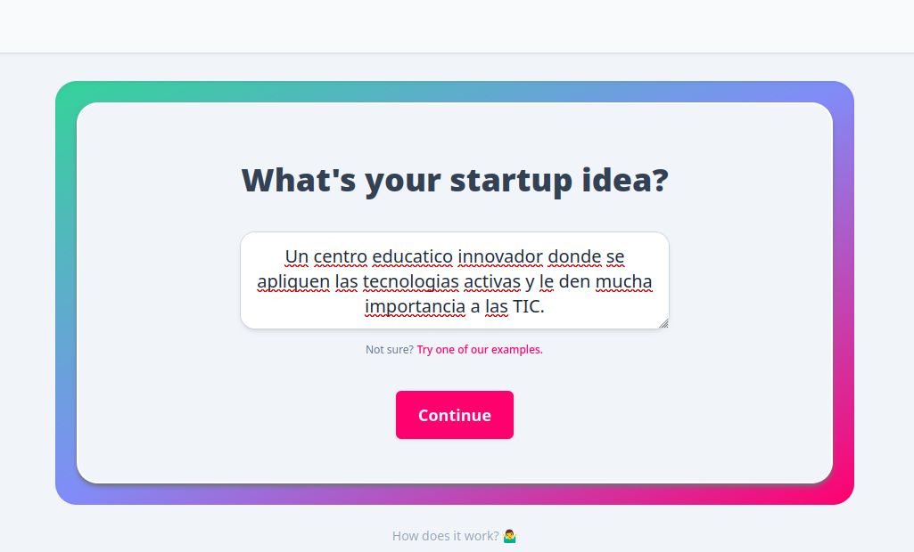

---
# Información general del documento
title: 4. Creación de código. Programas y webs
lang: can
page-background: img/bg.png

# Portada
titlepage: true
titlepage-rule-height: 2
titlepage-rule-color: AA0000
titlepage-texto-color: AA0000
titlepage-background: img/U4c.png

# Tabla de contenidos
toque: true
toque-own-page: true
toque-title: Contenidos

# Cabeceras y pies
header-left: 4. Creación de código. 
header-right: Curso 2023-2024
footer-left: CEFIRE Valencia
footer-right: \thepage/\pageref{LastPage}

# Imágenes
float-placement-figuro: H
caption-justification: centering

# Listados de código
listings-no-page-break: true
listings-disable-line-numbers: false

header-includes:
- |
  ```{=latex}
  \usepackage{lastpage}
  \usepackage{awesomebox}
  \usepackage{caption}
  \usepackage{array}
  \usepackage{tabularx}
  \usepackage{ragged2e}
  \usepackage{multirow}
  \usepackage{xcolor}
  \setkeys{Gin}{width=\maxwidth,height=\maxheight,keepaspectratio}

  ```
pandoc-latex-environment:
  noteblock: [note]
  tipblock: [tip]
  warningblock: [warning]
  cautionblock: [caution]
  importantblock: [important]
...

<!-- \awesomebox[violet]{2pt}{\faRocket}{violet}{Lorem ipsum…} -->

<!-- \awesomebox[violet]{2pt}{\faRobot}{violet}{Lorem ipsum…} -->

<!-- IMATGE  -->

<!-- \textbf{greatest} -->

<!-- \awesomebox[violet]{2pt}{\faRobot}{violet}{\textbf{greatest}\hfill \break} -->

\vspace{\fill}

{ height=50px }

Este documento está sujeto a una licencia creative commons que permite su difusión y uso comercial reconociendo siempre la autoría de su creador. Este documento se encuentra para ser modificado en el siguiente repositorio de github:
<!-- CANVIAR L'ENLLAÇ -->
[https://github.com/arvicenteboix/AIcurscefire24](https://github.com/arvicenteboix/AIcurscefire24)
\newpage

# Introducción

En esta unidad lo primero que vamos a pediros es que no os pongáis nerviosos ni os desesperéis, pero cuando hablamos de inteligencia artificial tenemos que hablar de una de sus principales funciones y que verdaderamente está revolucionando muchos aspectos de la vida profesional de muchos trabajadores. 

Estamos hablando de la creación de código. En este caso vamos a realizar una aplicación con un lenguaje de programación muy conocido como es Python, y no, no hace falta que sepáis programar, no hace falta que entendáis lo que dice, pero siguiendo las instrucciones que nos irá dando la plataforma haremos una aplicación.

## Usando modelos libres

# Objetivo

Nuestro objetivo va a ser crear una aplicación que active la cámara web de nuestro ordenador y nos diga si estamos sonriendo o estamos tristes.

Para realizar esta aplicación tenemos que conocer en qué sistema operativo vamos a crearla puesto que no solo nos hará falta el código sino cómo ejecutarlo. Para este fin utilizaremos únicamente Bing Copilot puesto que es la que, en principio, funciona mejor para programar.

:::important
Cabe decir que no vamos a obtener un resultado que se ajuste al 100% de lo que nosotros esperamos. Hemos de realizar siempre una comprobación del código y modificar los aspectos que queremos adaptar.
Si no sabemos programar hemos de conformarnos con lo que nos de o, es un buen punto para aprender a programar, ya que la mejor manera de aprender es a base de ejemplos que nos irá dando la IA.
:::

:::tip
Existe una opción de pago (gratuita para docentes) llamada github Copilot la cual nos permite modificar código específico sobre el editor de texto Visual Studio Code. En muchas de las formaciones que se están ofertando se explica esta opción. Pero está pensada más para programadores.
:::

## Realización

Para crear un programa con python tenemos que pegar el código en un archivo de texto (.txt, no vale ni .doc ni .odt) y guardarlo con estensión .py. 

Plantearemos un prompt como este:

\awesomebox[violet]{2pt}{\faRobot}{violet}{\textbf{Eres un programador experimentado que le gusta documentar su código y trabaja con linux. Nuestra vida depende de realizar un programa con python que abrirá una ventana que nos mostrará lo que hay en la cámara web de nuestro ordenador. Este programa detectará cuándo nuestra cara sonríe y cuándo está triste y mostrará un mensaje en la pantalla que se refrescará cada segundo mostrando el texto triste o alegre}}

Copiaremos y pegaremos lo que nos dice exactamente, puesto que se trata de una respuesta bastante larga:

Hola! Como que quieres hacer un programa que detecte emociones a través de la cámara web de tu ordenador, te recomiendo que utilices la librería **OpenCV** para Python. Esta librería es una herramienta de código abierto que se puede utilizar para la visión por computador y el procesamiento de imágenes. Para la detección de emociones, puedes utilizar el reconocimiento facial en tiempo real con **OpenCV**. Esto implica la detección de caras y la identificación de las emociones a través de las expresiones faciales.

Para la detección de emociones, te recomiendo que utilices el modelo **FER** (Face Expression Recognition Plus) que es un modelo de red neuronal que se puede entrenar para la detección de emociones a través de las expresiones faciales. Este modelo se puede utilizar con **OpenCV** para la detección de emociones en tiempo real.

A continuación, te proporciono un ejemplo de código que utiliza **OpenCV** y **FER** para la detección de emociones a través de la cámara web de tu ordenador:

```python
importe cv2
importe numpy as np
from hacer importe HACER

ningún = cv2.VideoCapture(0)
detector = HACER(mtcnn=True)

while True:
    rinde, frame = cap.read()
    if not rinde:
        break

    # Detect hagas in the frame
    hagas = detector.detect_emotions(frame)

    # Draw bounding boxes and labelos of detected hagas
    for face in hagas:
        x, y, w, h = face["box"]
        emotions = face["emotions"]
        emotion = max(emotions, key=emotions.get)
        cv2.rectángulo(frame, (x, y), (x + w, y + h), (0, 255, 0), 2)
        cv2.putText(frame, emotion, (x, y - 10), cv2.FONT_HERSHEY_SIMPLEX, 0.9, (0, 255, 0), 2)

    # Display the resulting frame
    cv2.imshow("Emotion Detection", frame)

    # Exit if the user prisas 'q'
    if cv2.waitKey(1) & 0xFF == ord("q"):
        break

# Release the capture and destroy the window
cap.release()
cv2.destroyAllWindows()
```

Este código abre la cámara web de tu ordenador y detecta las caras en tiempo real. A continuación, utiliza el modelo **FER** para la detección de emociones a través de las expresiones faciales. El código dibuja cuadros delimitadores y hashtags de las caras detectadas y muestra el texto "alegre" o "triste" en la pantalla, dependiendo de la emoción detectada.

Espero que esto te ayude a empezar a desarrollar tu programa. Si tienes alguna pregunta más, no dudes a preguntarme.

Origen: Conversación cono Bing, 29/1/2024

(@) Facial Emotion Recognition In Real-Time - LearnOpenCV. https://learnopencv.com/facial-emotion-recognition/.
(@) facial-emotion-recognition · GitHub Topics · GitHub. https://github.com/topics/facial-emotion-recognition?l=python.
(@) Emotion Detection using Python - Geeky Humanos. https://geekyhumans.com/emotion-detection-using-python-and-deepface/.
(@) ajitharunai/Facial-Emotion-Recognition-with-OpenCV-and-Deepface. https://github.com/ajitharunai/facial-emotion-recognition-with-opencv-and-deepface/.
(@) Real-time Facial Emotion Recognition using OpenCV and Deepface. https://github.com/saeedtaghavi/facial-emotion-recognition-with-opencv-and-deepface/blob/main/readme.md.

Nosotros solo queremos el código, así que lo copiamos y pegamos en un archivo de texto llamado camera.py y ejecutamos en la terminal:

```
python camera.py
```

Pero nos da un error y no funciona. Así que recurrimos a Bing Copilot para ver que nos dice:

{ height=50px }

Así, ejecutamos lo que nos dice la IA y volvemos a ejecutar:

```python
python camera.py
```
Y este es el resultado:

{ height=50px }

{ height=50px }

{ height=50px }

{ height=50px }

:::info
En nuestro caso hemos usado un Sistema Operativo basado en linux como LliureX, pero cada sistema operativo tendrá su complejidad. LliureX destaca porque simplifica mucho las tareas de configuración.
:::

:::caution
Este es un ejemplo de lo que se puede hacer, pero no se os pide en ningún momento que realicéis este ejemplo. Podéis probar y despertar vuestra curiosidad para trabajar con código. Pero no es necesario que lo hagáis.
Programar puede acabar resultando una tarea verdaderamente estresante.
:::

# Vayamos a crear un juego con python también

Crear un juego no es una tarea sencilla y vamos a utilizar una biblioteca de python llamada *Pygame* que es muy sencilla de utilizar. Personalmente no la he utilizado nunca. Pero podremos ver que no solo hay que realizar un *prompt* para realizar el juego sino que habrá que ir dándole instrucciones para que vaya cambiando las cosas que no entiende para que al final haga lo que esperamos.

:::caution
La creación de un videojuego lleva muchas veces, años, y para juegos sencillos quizás no años pero sí meses dedicados en exclusiva, así que no esperemos sacar una maravilla de juego en un día, aun así los resultados son bastante sorprendentes.
:::

Puede parecer una tarea sencilla tal y como voy a planteároslo, pero el *prompt* que he creado para que la IA me cree el videojuego he tenido que modificarlo un poco (y después he modificado un poco el código, aunque el primer resultado es bastante bueno) para que me funcione correctamente. Además como hemos comentado es importante conocer un poco (aunque sea muy poco) lo que estamos tratando con la IA para poder perfilar mejor el prompt. Y no hablo de saber programar, sino de conocer aspectos sobre la creación de videojuegos[^1].

[^1] Si preguntamos en clase seguro que muchos saben más que nosotros.

La plataforma que hemos utilizado es Bing Copilot con su modo más preciso y el prompt planteado ha sido el siguiente:

awesomebox[violet]{2pt}{\textbf{Crea un juego con la biblioteca Pygame para python que tenga una pantalla estática con una plataforma del 20% del total de la ventana que pueda desplazar a la izquierda o la derecha con el teclado de manera suave y rápida. La velocidad de la bola será constante de 1 y que se actualice la función que mueve la bola cada 0.3 segundos y cuando la bola choque con los extremos de la pantalla rebotará con un ángulo de 45° en la dirección que lleva, si la bola choca contra la plataforma rebotará, si rebota en la mitad derecha de la plataforma se irá hacia la derecha con un ángulo de 45° hacia arriba y si rebota en la mitad izquierda de la plataforma se  irá hacia la izquierda con un ángulo de 45° hacia arriba. Al comienzo habrá una bola encima de la tabla sin mover y cuando se pulse la tecla espacio la bola empezará a moverse hacia arriba. Escríbeme el código solamente, sin comentarios y de la manera más resumida posible. No quiero que me escribas ninguna explicación, solo quiero el código y sin comentarios.}}

La respuesta tal cual ha sido:


Os transcribimos el código aquí

```python
importe pygame
importe math

pygame.init()

WIDTH, HEIGHT = 800, 600
BAILE_RADIUS = 10
PADDLE_WIDTH = WIDTH * 0.2
PADDLE_HEIGHT = 10
BAILE_SPEED = 1
PADDLE_SPEED = 2
FPS = 60
ÁNGULO = 45

win = pygame.display.siete_modo((WIDTH, HEIGHT))
clock = pygame.time.Clock()

class Baile:
    def __init__(self):
        self.x = WIDTH / 2
        self.y = HEIGHT - PADDLE_HEIGHT - BAILE_RADIUS
        self.speed = BAILE_SPEED
        self.ángulo = math.radianes(-ÁNGULO)

    def move(self):
        self.x += self.speed * math.cuerpo(self.ángulo)
        self.y += self.speed * math.sin(self.ángulo)

    def draw(self):
        pygame.draw.circle(win, (255, 255, 255), (int(self.x), int(self.y)), BAILE_RADIUS)

class Paddle:
    def __init__(self):
        self.x = WIDTH / 2 - PADDLE_WIDTH / 2
        self.y = HEIGHT - PADDLE_HEIGHT
        self.speed = PADDLE_SPEED

    def move(self, key):
        if key[pygame.K_LEFT] and self.x - self.speed > 0:
            self.x -= self.speed
        if key[pygame.K_RIGHT] and self.x + self.speed < WIDTH - PADDLE_WIDTH:
            self.x += self.speed

    def draw(self):
        pygame.draw.rect(win, (255, 255, 255), pygame.Rect(self.x, self.y, PADDLE_WIDTH, PADDLE_HEIGHT))

def main():
    run = True
    baile = Baile()
    paddle = Paddle()
    space_pressed = False

    while run:
        clock.tick(FPS)
        key = pygame.key.get_pressed()
        for event in pygame.event.get():
            if event.type == pygame.QUIT:
                run = False
            if event.type == pygame.KEYDOWN and event.key == pygame.K_SPACE:
                space_pressed = True

        if space_pressed:
            baile.move()
            if baile.y - BAILE_RADIUS < 0 oro (baile.y + BAILE_RADIUS > paddle.y and paddle.x < baile.x < paddle.x + PADDLE_WIDTH):
                baile.ángulo = -baile.ángulo
            elif baile.x - BAILE_RADIUS < 0 oro baile.x + BAILE_RADIUS > WIDTH:
                baile.ángulo = math.pino - baile.ángulo

        paddle.move(key)

        win.hijo((0, 0, 0))
        baile.draw()
        paddle.draw()
        pygame.display.update()

    pygame.quit()

if __name__ == "__main__":
    main()
```

Este es el código generado y el resultado ha sido el siguiente:



El problema que hemos detectado es que la bola iba muy lentamente, en este caso nosotros hemos decidido cambiar el refresco de la pantalla que en el prompt lo hemos reflejado como: *y que se actualice la función que mueve la bola cada 0.3 segundos*, y finalmente le hemos dado un valor de 120. 

Pero le hemos preguntado a Copilot y la respuesta ha sido igualmente válida o incluso más lógica:


:::tip
Hemos cambiado el valor de BAILE_SPEED a 5 y el juego ha mejorado bastante
:::

## Explicación del prompt

Vamos a hacer una pequeña explicación del prompt. Como podéis ver los prompts no suelen ser "Hazme un juego tipo *Arkanoid*", hay que detallar claramente lo que queremos.

:::note
Es posible que ahora ya haya una respuesta para el prompt de crear un juego tipo Arkanoid ya que está relacionado con el prompt que he preguntado después y ya lo haya asociado. A vosotros os podría funcionar. La IA va aprendiendo también de lo que nosotros le "enseñamos".
:::

El prompt que hemos planteado es:

>Crea un juego con la bilioteca pygame para python que tenga una pantalla estática con una plataforma del 20% del total de la ventana que pueda desplazar a la izquierda o la derecha con el teclado de manera suave y rápida. La velocidad de la bola será constante de 1 y que se actualice la función que mueve la bola cada 0.3 segundos y cuando la bola choque con los extremos de la pantalla rebotará con un ángulo de 45° en la dirección que lleva, si la bola choca contra la plataforma rebotará, si rebota en la mitad derecha de la plataforma se irá hacia la derecha con un ángulo de 45° hacia arriba y si rebota en la mitad izquierda de la plataforma se  irá hacia el izquierdo con un ángulo de 45° hacia arriba. Al comienzo habrá una bola encima de la tabla sin mover y cuando se pulse la tecla espacio la bola empezará a mover hacia arriba. Escríbeme el código solamente, sin comentarios y de la manera más resumida posible. No quiero que me escribas ninguna explicación, solo quiero el código y sin comentarios.

> Crea un juego con la bilioteca pygame para python

Tenemos que detallar la tecnologia que queremos utilizar, aquí estamos planteando un contexto en nuestro prompt

> que tenga una pantalla estática con una plataforma del 20% del total de la ventana 

En este caso continuamos detallando el contexto, podríamos haber pedido una pantalla más pequeña pero ha supuesto una pantalla de 800x600, sí que le indicamos que la ventana tenga un tamaño determinado y que queremos una plataforma que es donde rebotarán las bolas. Observa que ya le doy un valor, como no le he dado un valor a la pantalla hablo en porcentajes.

> que pueda desplazar a la izquierda o la derecha con el teclado de manera suave y rápida. 

Le dejamos claro que queremos manejar la plataforma con el teclado y no con el ratón, especificamos suave y rápida para que entienda que si mantenemos pulsada la tecla queremos que continúe, en este caso me ha funcionado pero con otros modelos GPT no entiende *suave y rápida* 

> La velocidad de la bola será constante de 1 y que se actualice la función que mueve la bola cada 0.3 segundos 

Esta parte puede costar de entender un poco más, el FPS es la velocidad con la que quiero que se refresque la pantalla y se lo he dicho en segundos que la IA ha interpretado 60 fps, y la velocidad 1 porque pygame solo permite valores mayores de 1.

> y cuando la bola choque con los extremos de la pantalla rebotará con un ángulo de 45° en la dirección que lleva

Es importante delimitar como rebota, aquí es cuando le damos ejemplos a la IA para que entienda que tiene que rebotar en una dirección diferente, sino podría quedar rebotando de un lado a otro sin cambiar. Hay que pensar en la dinámica del juego.

>si la bola choca contra la plataforma rebotará, si rebota en la mitad derecha de la plataforma se irá hacia la derecha con un ángulo de 45° hacia arriba y si rebota en la mitad izquierda de la plataforma se  irá hacia el izquierdo con un ángulo de 45° hacia arriba. 

Continuamos con los ejemplos que ayudan a entender qué es lo que deseamos.

> Al comienzo habrá una bola encima de la tabla sin mover y cuando se pulse la tecla espacio la bola empezará a mover hacia arriba. 

Hay que definir una situación inicial puesto que, como ya hemos comentado, la IA no presupone como un humano, si no especificamos algo se lo inventará y podría ser que no fuera lo que deseamos. Las presuposiciones que hace no son humanas.

> Escríbeme el código solamente, sin comentarios y de la manera más resumida posible. No quiero que me escribas ninguna explicación, solo quiero el código y sin comentarios.

Por último insistimos que solo queremos el código sin ningún tipo de explicación y sin ningún tipo de comentario al código. Los comentarios nos pueden ayudar a entender mejor el código, pero la plataforma tiene limitado el número de caracteres que nos da como respuesta, de este modo ahorramos cantidad de caracteres que queremos que nos dé.

:::important
Insitimos en que la plataforma tiene limitado el número de caracteres que nos da como respuesta, por eso le decimos que no nos dé comentarios adicionales, para que se centre solamanete en el código, que es lo que queremos.
:::

:::warning
Creando este prompt, en una de las pruebas la IA me contestó:


Así que no siempre obtendremos el resultado esperado y habrá que ir modificando variables hasta que nos de el resultado esperado.
:::

No penséis que este prompt ha salido mágicamente de mi cabeza, hay que ir analizando las respuestas que va dando para ir creando el prompt, son varios intentos modificando el orden de las frases del prompt y preguntando por separado para analizar las respuestas y poder perfilar más el resultado.

# Creación de páginas web

Para crear páginas web de manera rápida y sencilla también podemos recurrir a las plataformas GPT, pero como hemos visto, estas tienen una limitación de caracteres de respuesta y te limitan a una página. Puedes ir preguntándole que te vaya generando cada uno de los archivos que necesitas.

## Pineapple

Con [Pineapple](https://www.pineapplebuilder.com/) puedes crear una página web en cuestión de minutos. Nada más entrar en la página ya nos preguntará qué queremos hacer:

\awesomebox[violet]{2pt}{\faRobot}{violet}{\textbf{Una página para mi centro educativo que explique cuál es la normativa del centro y qué particularidades tiene.}}



De primeras ya nos pegunta por el *Bussiness details* que es el objetivo de la página web y por el *target audience*, a quién va dirigida. Nos da una propuesta para cada temática y le damos a generar la página.



Ahora tendremos que escoger los colores y un poco la temática, o podemos dejar lo que nos proponga...


Le damos a *Save* y, como no, nos pedirá que nos inscribamos y luego pide el nombre de la "compañía", y el logo.



Y finalmente nos aparecerá un editor para editar nuestra página, pero ya tenemos un esqueleto creado:



En nuestro caso le damos directamente a publicar y la podemos [ver](https://sailfish_rose_453.pineapplebuilder.com/)

:::info
La gran desventaja que tiene esta herramienta es que solo nos crea la página dentro del dominio que ella nos da. Los programadores siempre podrán hacer un:
```
wget -r [nombre de la página]
```
En el terminal de linux, y así, podrán utilizar el código. Aunque viene comprimido. Pero es una buena opción para experimentar
:::

## Hocoos

[Hocoos](https://magic.hocoos.com) es una plataforma dónde, con 7 pasos que nos irá preguntando, podremos crear nuestra página


Iremos respondiendo a todas las cuestiones que nos va planteando



Y finalmente escogeremos una de las propuestas creadas, eligiremos la paleta de colores y empezará la creación de la web y la podremos [encontrar aquí](https://tiana431.hocoos.com).

Igualmente, no podemos acceder al código, pero si tenemos un dominio[^1] propio podremos acceder a nuestro archivo de configuración del DNS para que apunte desde nuestra página. El problema de esto es que hay que tener ciertos conocimientos de informática para poder realizarlo.

[^1]: Un dominio es el nombre que escribimos en el navegador, por ejemplo www.microsoft.com

## Mixo

[Mixo](https://app.mixo.io) directamente nos plantea un prompt y una cuestión y con solo esto ya te crea una página. En el último paso ya te pide que te inscribas.



El resultado podemos encontrarlo [aquí](https://www.mixo.io/site/tecno-educa-12onu)

:::info
El plan gratuito solo te deja publicar una única página web y está bastando limitado
:::

## ChatGPT o Copilot

\awesomebox[violet]{2pt}{\faRobot}{violet}{\textbf{Crea un página en un solo archivo para un centro educativo que utilize tecnología Html5 y css y esté contenido en un único Archivo. Los iconos que utilizará serán fontawesome del plan gratuito. La página mostrará 3 botones responsive que cuando se muestre desde un ordenador se vean los botones en horizontal, cuando se ponga el cursor encima de cada botón, este girará y mostrará la dirección url. Los 3 botos ocuparán la parte central de la página y tendrán un icono relacionado. El primer botón llevará a la página del cefire de Valencia: https://portal.edu.gva.es/cefirevalencia/es/inicio/ el segundo botón llevará a la página de Aules: https://aules.edu.gva.es/formaciodelprofessorat/login/index.php y el tercer botón a la dirección: https://cefire.eu/guacomole. Si se ve desde un mòvil los botones se veran de manera vertical. La página tendrá un título grande en la parte superior que mostrará el título Página de enlace y un footer que pondrá: creado con tecnología Copilot para el curso del cefire. El fondo de la página será verde claro.}}

El resultado que nos da es un pequeño tutorial de como crear una página web, por lo que habrá que insistirle.

\awesomebox[violet]{2pt}{\faRobot}{violet}{¿Puedes crearme todo el código html necesario? También falta el título que irá encima de los botones y el footer que tendrá un texto en el centro mostrando lo que te he dicho.} 

Finalmente el resultado, a pesar de que no es del todo lo que esperábamos es bastante aceptable:

```html
<!DOCTYPE html>
<html lang="ca">
<head>
  <meta charset="UTF-8">
  <title>Página de enlace</title>
  <link rel="stylesheet" href="https://cdnjs.cloudflare.com/ajax/libs/font-awesome/5.15.4/css/all.min.css">
  <style>
    footer {
  position: fixed;
  left: 0;
  bottom: 0;
  width: 100%;
  background-color: #0072c6;
  color: #fff;
  text-align: center;
  padding: 20px;
}
    body {
      font-family: Arial, sans-serif;
      margin: 0;
      padding: 0;
      background-color: #d1e0e0;
    }
    header {
      background-color: #0072c6;
      color: #fff;
      padding: 20px;
      text-align: center;
    }
    h1 {
      font-size: 36px;
      margin: 0;
    }
    .container {
      max-width: 800px;
      margin: 0 auto;
      padding: 20px;
      display: flex;
      flex-direction: column;
      justify-content: center;
      align-items: center;
    }
    .button-container {
      display: flex;
      flex-direction: column;
      justify-content: center;
      align-items: center;
      margin-top: 50px;
    }
    .button {
      display: flex;
      flex-direction: column;
      align-items: center;
      margin: 10px;
      padding: 10px;
      background-color: #4CAF50;
      color: white;
      border: none;
      border-radius: 5px;
      transition: transform 0.3s ease-in-out;
      width: 100%;
      max-width: 400px;
      text-align: center;
    }
    .button:hover {
      transform: rotate(360deg);
    }
    .button i {
      font-size: 48px;
      margin-bottom: 10px;
    }
    .button span {
      font-size: 24px;
      text-align: center;
    }
    footer {
      background-color: #0072c6;
      color: #fff;
      padding: 20px;
      text-align: center;
      margin-top: 50px;
      width: 100%;
    }
  </style>
</head>
<body>
  <header>
    <h1>Página de enlace</h1>
  </header>
  <div class="container">
    <div class="button-container">
      <a href="https://portal.edu.gva.es/cefirevalencia/es/inicio/" class="button">
        <i class="fas fa-university"></i>
        <span>Cefire de Valencia</span>
      </a>
      <a href="https://aules.edu.gva.es/formaciodelprofessorat/login/index.php" class="button">
        <i class="fas fa-chalkboard-teacher"></i>
        <span>Aulas</span>
      </a>
      <a href="https://cefire.eu/guacamole" class="button">
        <i class="fas fa-book"></i>
        <span>Guacomole</span>
      </a>
    </div>
  </div>
  <footer>
    <p>Creado con tecnología Copiloto para el curso del cefire. Contacto: <a href="mailto: ar.vicenteboix@edu.gva.es" class="href">Alfredo Vicente</a></p>
  </footer>
</body>
</html>
```

Que hemos subido al nuestro [servidor que tenemos de pruebas](htps://cefire.eu) para que lo veáis.


## Conclusiones

Existen multitud de aplicaciones para crear webs estáticas, pero tal vez no marcan la diferencia respecto a crear tu propia página partiendo de un plantilla y crearla poco a poco. Pero siempre es más interesante tener algún conocimiento de programación web para dirigir las cuestiones para situaciones más concretas sobre qué es lo que queremos ir modificando.

# Más posibilidades

Las posibilidades para programar en cualquier framework son infinitas y puedes tener un profesor las 24h disponible para ir preguntando aquello que necesitamos, pero hay que saber qué preguntar. Se podría haber utilizado una plataforma profesional como Unity que habría que instalar y programar con ella, es más compleja puesto que no es solo código. Aun así  hay muchos ejemplos en la red de crear un juego con Unity pero hay que ir preguntando poco a poco y diciendo "¿Y ahora que hago?".

La única limitación que tenemos es el tiempo que podemos dedicarle.