---
# Información general del documento
title: 4. Creación de código.
lang: es
page-background: img/bg.png
linkcolor: blue

# Portada
titlepage: true
titlepage-rule-height: 3
titlepage-rule-color: e6e6e6
titlepage-text-color: e6e6e6
titlepage-background: img/U4c.png

# Tabla de contenidos
toc: true
toc-own-page: true
toc-title: Contenidos

# Cabeceras y pies
header-left: 4. Creación de código. 
header-right: Curso 2024-2025
footer-left: CEFIRE FP
footer-right: \thepage/\pageref{LastPage}

# Imágenes
float-placement-figuro: H
caption-justification: centering

# Listados de código
listings-no-page-break: true
listings-disable-line-numbers: false

header-includes:
- |
  ```{=latex}
  \usepackage{lastpage}
  \usepackage{awesomebox}
  \usepackage{caption}
  \usepackage{array}
  \usepackage{tabularx}
  \usepackage{ragged2e}
  \usepackage{multirow}
  \usepackage{xcolor}
  \setkeys{Gin}{width=\maxwidth,height=\maxheight,keepaspectratio}

  ```
pandoc-latex-environment:
  noteblock: [note]
  tipblock: [tip]
  warningblock: [warning]
  cautionblock: [caution]
  importantblock: [important]
...

<!-- \awesomebox[violet]{2pt}{\faRocket}{violet}{Lorem ipsum…} -->

<!-- \awesomebox[violet]{2pt}{\faRobot}{violet}{Lorem ipsum…} -->

<!-- IMATGE { width=70% } -->

<!-- \textbf{greatest} -->

<!-- \awesomebox[violet]{2pt}{\faRobot}{violet}{\textbf{greatest}\hfill \break} -->

\vspace*{\fill}

{ height=50px }

Este documento está sujeto a una licencia creative commons que permite su difusión y uso comercial reconociendo siempre la autoría de su creador. Este documento se encuentra para ser modificado en el siguiente repositorio de github:
<!-- CANVIAR L'ENLLAÇ -->
[https://github.com/arvicenteboix/AIcurscefire24](https://github.com/arvicenteboix/AIcurscefire24)
\newpage

# Introducción

En esta unidad lo primero que vamos a pediros es que no os pongáis nerviosos ni os desesperéis, pero cuando hablamos de inteligencia artificial tenemos que hablar de una de sus principales funciones y que verdaderamente está revolucionando muchos aspectos de la vida profesional de muchos trabajadores. 

Estamos hablando de la creación de código. En este caso vamos a realizar una aplicación con un lenguaje de programación muy conocido como es Python, y no, no hace falta que sepáis programar, no hace falta que entendáis lo que dice, pero siguiendo las instrucciones que nos irá dando la plataforma haremos una aplicación.

## Usando modelos libres

# Objetivo

Nuestro objetivo va a ser crear una aplicación que active la cámara web de nuestro ordenador y nos diga si estamos sonriendo o estamos tristes.

Para realizar esta aplicación tenemos que conocer en qué sistema operativo vamos a crearla puesto que no solo nos hará falta el código sino cómo ejecutarlo. Para este fin utilizaremos únicamente Bing Copilot puesto que es la que, en principio, funciona mejor para programar.

:::important
Cabe decir que no vamos a obtener un resultado que se ajuste al 100% de lo que nosotros esperamos. Hemos de realizar siempre una comprobación del código y modificar los aspectos que queremos adaptar.
Si no sabemos programar hemos de conformarnos con lo que nos de o, es un buen punto para aprender a programar, ya que la mejor manera de aprender es a base de ejemplos que nos irá dando la IA.
:::

:::tip
Existe una opción de pago (gratuita para docentes) llamada github Copilot la cual nos permite modificar código específico sobre el editor de texto Visual Studio Code. En muchas de las formaciones que se están ofertando se explica esta opción. Pero está pensada más para programadores.
:::

## Realización

Para crear un programa con python tenemos que pegar el código en un archivo de texto (.txt, no vale ni .doc ni .odt) y guardarlo con estensión .py. 

Plantearemos un prompt como este:

\awesomebox[violet]{2pt}{\faRobot}{violet}{\textbf{Eres un programador experimentado que le gusta documentar su código y trabaja con linux. Nuestra vida depende de realizar un programa con python que abrirá una ventana que nos mostrará lo que hay en la cámara web de nuestro ordenador. Este programa detectará cuándo nuestra cara sonríe y cuándo está triste y mostrará un mensaje en la pantalla que se refrescará cada segundo mostrando el texto triste o alegre}}

Copiaremos y pegaremos lo que nos dice exactamente, puesto que se trata de una respuesta bastante larga:

Hola! Como que quieres hacer un programa que detecte emociones a través de la cámara web de tu ordenador, te recomiendo que utilices la librería **OpenCV** para Python. Esta librería es una herramienta de código abierto que se puede utilizar para la visión por computador y el procesamiento de imágenes. Para la detección de emociones, puedes utilizar el reconocimiento facial en tiempo real con **OpenCV**. Esto implica la detección de caras y la identificación de las emociones a través de las expresiones faciales.

Para la detección de emociones, te recomiendo que utilices el modelo **FER** (Face Expression Recognition Plus) que es un modelo de red neuronal que se puede entrenar para la detección de emociones a través de las expresiones faciales. Este modelo se puede utilizar con **OpenCV** para la detección de emociones en tiempo real.

A continuación, te proporciono un ejemplo de código que utiliza **OpenCV** y **FER** para la detección de emociones a través de la cámara web de tu ordenador:

```python
importe cv2
importe numpy as np
from hacer importe HACER

ningún = cv2.VideoCapture(0)
detector = HACER(mtcnn=True)

while True:
    rinde, frame = cap.read()
    if not rinde:
        break

    # Detect hagas in the frame
    hagas = detector.detect_emotions(frame)

    # Draw bounding boxes and labelos of detected hagas
    for face in hagas:
        x, y, w, h = face["box"]
        emotions = face["emotions"]
        emotion = max(emotions, key=emotions.get)
        cv2.rectángulo(frame, (x, y), (x + w, y + h), (0, 255, 0), 2)
        cv2.putText(frame, emotion, (x, y - 10), cv2.FONT_HERSHEY_SIMPLEX, 0.9, (0, 255, 0), 2)

    # Display the resulting frame
    cv2.imshow("Emotion Detection", frame)

    # Exit if the user prisas 'q'
    if cv2.waitKey(1) & 0xFF == ord("q"):
        break

# Release the capture and destroy the window
cap.release()
cv2.destroyAllWindows()
```

Este código abre la cámara web de tu ordenador y detecta las caras en tiempo real. A continuación, utiliza el modelo **FER** para la detección de emociones a través de las expresiones faciales. El código dibuja cuadros delimitadores y hashtags de las caras detectadas y muestra el texto "alegre" o "triste" en la pantalla, dependiendo de la emoción detectada.

Espero que esto te ayude a empezar a desarrollar tu programa. Si tienes alguna pregunta más, no dudes a preguntarme.

Origen: Conversación cono Bing, 29/1/2024

(@) Facial Emotion Recognition In Real-Time - LearnOpenCV. https://learnopencv.com/facial-emotion-recognition/.
(@) facial-emotion-recognition · GitHub Topics · GitHub. https://github.com/topics/facial-emotion-recognition?l=python.
(@) Emotion Detection using Python - Geeky Humanos. https://geekyhumans.com/emotion-detection-using-python-and-deepface/.
(@) ajitharunai/Facial-Emotion-Recognition-with-OpenCV-and-Deepface. https://github.com/ajitharunai/facial-emotion-recognition-with-opencv-and-deepface/.
(@) Real-time Facial Emotion Recognition using OpenCV and Deepface. https://github.com/saeedtaghavi/facial-emotion-recognition-with-opencv-and-deepface/blob/main/readme.md.

Nosotros solo queremos el código, así que lo copiamos y pegamos en un archivo de texto llamado camera.py y ejecutamos en la terminal:

```
python camera.py
```

Pero nos da un error y no funciona. Así que recurrimos a Bing Copilot para ver que nos dice:

{ width=70% }

Así, ejecutamos lo que nos dice la IA y volvemos a ejecutar:

```python
python camera.py
```
Y este es el resultado:

{ width=70% }

{ width=70% }

{ width=70% }

{ width=70% }

:::info
En nuestro caso hemos usado un Sistema Operativo basado en linux como LliureX, pero cada sistema operativo tendrá su complejidad. LliureX destaca porque simplifica mucho las tareas de configuración.
:::

:::caution
Este es un ejemplo de lo que se puede hacer, pero no se os pide en ningún momento que realicéis este ejemplo. Podéis probar y despertar vuestra curiosidad para trabajar con código. Pero no es necesario que lo hagáis.
Programar puede acabar resultando una tarea verdaderamente estresante.
:::

# Vayamos a crear un juego con python también

Crear un juego no es una tarea sencilla y vamos a utilizar una biblioteca de python llamada *Pygame* que es muy sencilla de utilizar. Personalmente no la he utilizado nunca. Pero podremos ver que no solo hay que realizar un *prompt* para realizar el juego sino que habrá que ir dándole instrucciones para que vaya cambiando las cosas que no entiende para que al final haga lo que esperamos.

:::caution
La creación de un videojuego lleva muchas veces, años, y para juegos sencillos quizás no años pero sí meses dedicados en exclusiva, así que no esperemos sacar una maravilla de juego en un día, aun así los resultados son bastante sorprendentes.
:::

Puede parecer una tarea sencilla tal y como voy a planteároslo, pero el *prompt* que he creado para que la IA me cree el videojuego he tenido que modificarlo un poco (y después he modificado un poco el código, aunque el primer resultado es bastante bueno) para que me funcione correctamente. Además como hemos comentado es importante conocer un poco (aunque sea muy poco) lo que estamos tratando con la IA para poder perfilar mejor el prompt. Y no hablo de saber programar, sino de conocer aspectos sobre la creación de videojuegos[^1].

[^1] Si preguntamos en clase seguro que muchos saben más que nosotros.

La plataforma que hemos utilizado es Bing Copilot con su modo más preciso y el prompt planteado ha sido el siguiente:

\awesomebox[violet]{2pt}{\faRobot}{violet}{Crea un juego con la biblioteca Pygame para python que tenga una pantalla estática con una plataforma del 20% del total de la ventana que pueda desplazar a la izquierda o la derecha con el teclado de manera suave y rápida. La velocidad de la bola será constante de 1 y que se actualice la función que mueve la bola cada 0.3 segundos y cuando la bola choque con los extremos de la pantalla rebotará con un ángulo de 45° en la dirección que lleva, si la bola choca contra la plataforma rebotará, si rebota en la mitad derecha de la plataforma se irá hacia la derecha con un ángulo de 45° hacia arriba y si rebota en la mitad izquierda de la plataforma se  irá hacia la izquierda con un ángulo de 45° hacia arriba. Al comienzo habrá una bola encima de la tabla sin mover y cuando se pulse la tecla espacio la bola empezará a moverse hacia arriba. Escríbeme el código solamente, sin comentarios y de la manera más resumida posible. No quiero que me escribas ninguna explicación, solo quiero el código y sin comentarios.}

La respuesta tal cual ha sido:

{ width=70% }

Os transcribimos el código aquí

```python
import pygame
import sys

pygame.init()
screen = pygame.display.set_mode((800, 600))
clock = pygame.time.Clock()

ball = pygame.Rect(400, 570, 10, 10)
paddle = pygame.Rect(350, 580, 100, 10)
ball_speed = [3, -3]
paddle_speed = 10
moving = False

while True:
    for event in pygame.event.get():
        if event.type == pygame.QUIT:
            pygame.quit()
            sys.exit()
        if event.type == pygame.KEYDOWN:
            if event.key == pygame.K_SPACE:
                moving = True

    keys = pygame.key.get_pressed()
    if keys[pygame.K_LEFT] and paddle.left > 0:
        paddle.move_ip(-paddle_speed, 0)
    if keys[pygame.K_RIGHT] and paddle.right < 800:
        paddle.move_ip(paddle_speed, 0)

    if moving:
        ball.move_ip(ball_speed[0], ball_speed[1])

        if ball.left <= 0 or ball.right >= 800:
            ball_speed[0] = -ball_speed[0]
        if ball.top <= 0:
            ball_speed[1] = -ball_speed[1]
        if ball.colliderect(paddle):
            if ball.centerx < paddle.centerx:
                ball_speed = [-3, -3]
            else:
                ball_speed = [3, -3]

        if ball.bottom >= 600:
            ball.topleft = (400, 570)
            moving = False

    screen.fill((0, 0, 0))
    pygame.draw.ellipse(screen, (255, 255, 255), ball)
    pygame.draw.rect(screen, (255, 255, 255), paddle)
    pygame.display.flip()
    clock.tick(60)
```

Este es el código generado y el resultado ha sido el siguiente:

{ width=70% }

:::important
Tenéis que eliminar las citaciones que hace la IA al final del código, puesto que no son parte del código y pueden generar errores. En este caso: [_{{{CITATION{{{_1{](https://github.com/henrikots/fly-boy/tree/441b0442733ab0ebc499b5233804db110905a1f1/tutorial.py)
:::

:::tip
El problema que hem detectat és que la bola anava molt lentament, així que li hem demanat que la velocitat fora major. Però li hem preguntat a Copilot i ens ha arreglat el codi.
:::

## Explicació del prompt

Anem a fer una xicoteta explicació del prompt. Com podeu vore els prompts no solen ser "Fes-me un joc tipo Arkanoid", cal detallar clarament el que volem. I aquesta exlicació del prompt serveix per a qualsevol altre tipus de matèria.

:::note
És possible que ara ja hi haja una resposta per al prompt de crear un joc tipus Arkanoid ja que està relacionat amb el prompt que he preguntat després i ja ho haja associat. A vosaltres us podria funcionar. La IA va aprenent també del que nosaltres li "ensenyem".
:::

El prompt que hem plantejat és:

>Crea un joc amb la bilioteca pygame per a python que tinga una pantalla estàtica amb una plataforma del 20% del total de la finestra que puga desplaçar a l'esquerra o la dreta amb el teclat de manera suau i ràpida. La velocitat de la bola será constant de 1 i que s'actualitze la funció que mou la bola cada 0.3 segons i quan la bola xoque amb els extrems de la pantalla rebotarà amb un angle de 45º en la direcció que du, si la bola xoca contra la plataforma rebotarà, si rebota en la meitat dreta de la plataforma se n'anirà cap a la dreta amb un angle de 45º cap a dalt i si rebota en la meitat esquerra de la plataforma se n'anirà cap a l'esquerre amb un angle de 45º cap a dalt. Al començament hi haurà una bola damunt de la tabla sense moure's i quan es polse la tecla espai la bola començarà a moure's cap a dalt. Escriure-me el codi només, sense comentaris i de la manera més resumida possible. No vull que m'escrigues cap explicació, només vull el codi i sense comentaris.

> Crea un joc amb la bilioteca pygame per a python

Hem de detallar la tecnlogia que volem utiltizar, ací estem plantejant un context en el nostre prompt

> que tinga una pantalla estàtica amb una plataforma del 20% del total de la finestra 

En aquest cas continuem detallant el context, podríem haver demanat una pantalla més xicoteta però ha supossat una pantalla de 800x600, si que li indiquem que la finestra tinga un tamany determinat i volem una plataforma que és on rebotaran les boles. Vegeu que li done ja un valor, com que no li he donat un valor a la pantalla li parle en percentatges.

> que puga desplaçar a l'esquerra o la dreta amb el teclat de manera suau i ràpida. 

Li deixem clar que volem manejar la plataforma amb el teclat i no amb el ratolí, especifiquem suau i ràpida per a que entenga que si mantenim polsat la tecla volem que continue, en aquest cas m'ha funcionat però amb altres models GPT no entén suau i ràpida* 

> La velocitat de la bola será constant de 1 i que s'actualitze la funció que mou la bola cada 0.3 segons 

Aquesta part pot costar d'entendre un poc més, el FPS és la velocitat amb la que vull que es refresque la pantalla i li ho he dit en segons que la IA a interpretat 60 fps, i al velocitat 1 perquè pygame només permet valors majors de 1.

> i quan la bola xoque amb els extrems de la pantalla rebotarà amb un angle de 45º en la direcció que du

És important delimitar com rebota, ací és quan li donem exemples a la IA per a que entenga que ha de rebotar en una direcció diferent, sino podria quedar-se rebotant d'un costat a altre sense canviar. Cal pensar en la dinàmica del joc.

>si la bola xoca contra la plataforma rebotarà, si rebota en la meitat dreta de la plataforma se n'anirà cap a la dreta amb un angle de 45º cap a dalt i si rebota en la meitat esquerra de la plataforma se n'anirà cap a l'esquerre amb un angle de 45º cap a dalt. 

Continuem amb els exemples que ajuden a entendre què és el que desitgem.

> Al comienzo habrá una bola encima de la tabla sin #mover y cuando se polse la tecla espacio la bola empezará a #mover hacia arriba. 

Hay que definir una situación inicial puesto que, como ya hemos comentado, la IA no presupone como un humano, sino especificamos algo se lo inventará y podría ser que no fuera el que deseamos. Las presuposacions que hace no son humanas.

> Escribir-me el código solo, sin comentarios y de la manera más resumida posible. No quiero que me escribas ninguna explicación, solo quiero el código y sin comentarios.

Por último insistimos que solo volamos el código sin ningún tipo de explicación y sin ningún tipo de comentario al código. Los comentarios nos pueden ayudar a entender mejor el código, pero la plataforma tiene limitado el número de caracteres que nos da como respuesta, de este modo estaviem cantidad de caracteres que queremos que nos dé.

:::important
Insistimos que la plataforma tiene limitado el número de caracteres que nos da como respuesta, por eso insistimos que no nos doy comentarios adicionales, porque se centre únicamente en el código que es el que volamos
:::

:::warning
Creando este prompt, en una de las pruebas la IA me contestó:

{ width=70% }

Así que no siempre obtendremos los resultados esperados y habrá que ir modificando variables hasta que nos doy el resultado esperado.
:::

No penséis que este prompt ha salido mágicamente de mi cabeza, hay que ir analizando las respuestas que va dando para ir creando el prompt, son varios intentos modificando el orden de las frases del prompt y preguntando por separado para analizar las respuestas y poder perfilar más el resultado.


# Replit

[Replit](https://replit.com) es una plataforma que nos permite crear código de manera sencilla y rápida. Podemos crear código en diferentes lenguajes de programación y nos permite compartirlo con otras personas. Además, nos permite ejecutar el código en linea y ver el resultado en tiempo real. de forma que no vayamos a pediros que ejecutéis el código a vuestro ordenador, en cambio podemos hacerlo en esta plataforma.

{ width=70% }

Replit es una paltaforma muy potente y muy utilizada, en este caso cuando ente loguem y le decimos a todo que sí nos aparecerá una pantalla como esta:

{ width=70% }

Y Damos a create Repl:

{ width=70% }

Nos hará un breve tutotial, y al final nos aparecerá una pantalla como esta:

{ width=70% }

Polsem la tecla Ctrl+I y veremos que ente aapreix un diálogo donde podemos escribir nuestro prompt:

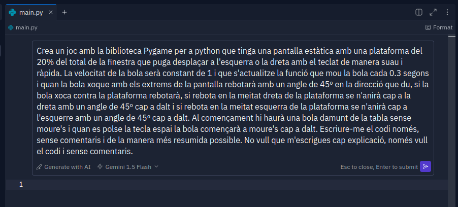{ width=70% }

Y nos da un resultado diferente a nuestra propuesta:

{ width=70% }

Lodonem a Accept y polsem el botón Run vert que hay arriba de todo. Nos aparecerá una pantalla como esta, donde polsarem la siguiente tecla para hacerla más grande:

{ width=70% }

Y ya veamos la pantalla en grande, es importante que polsem aquí para que detecte el teclado:

{ width=70% }

:::warning
El código generado por Copiloto ha funcionado mucho mejor, a Replit hemos cambiado los siguientes valores para que funcionara mucho más rápidamente. Pero podemos copiar el código de Copiloto y pegarlo aquí para que funciono correctamente.
baile_speed = 20
platform_speed = 20
time.sleep(0.1)
:::

Replit es una plataforma muy potente y puede servirnos para introduïr a los alumnos en la programación empezando con cosas mucho más sencillas como:

\awesomebox[violet]{2pt}{\faRobot}{violet}{Crea un programa que abra una ventana y me pregunto mi nombre, después cierra esa ventana y abra otra ventana que diga Hola + mi nombre y espero hasta que yo cierro esa ventana.}

{ width=70% }

Podéis ver el resultado [aquí](https://replit.com/join/ovvzfszftt-alviboigva)

:::tip
No hay que saber programar para utilizar la plataforma sino saber escribir prompts correctamente, podemos pensar que esta plataforma sirve solo para programadores, pero no es así. Puesto que fijaos la estructura del prompt, hay que saber explicar bien el que volamos. Y esto ayuda a desarrollar el pensamiento computacional
:::

\awesomebox[black]{2pt}{\faCode}{black}{Como docentes podemos hacer uso de github Copiloto que tendréis que solicitar a la plataforma de GitHub y que os permitirá modificar código en tiempo real y se integra muy bien dentro de Visual Studio Code.}

# Creamos una unidad en Aulas

En este apartado vayamos a crear una unidad desde 0, ya os hemos comentado que siempre es importante tener unas nociones básicas sobre el que se está preguntando. Vamos a hacer nuestra prueba en el nuestro [Aulas docente](https://aules.edu.gva.es/docent/my/).

:::tip
Tenéis opciones gratuitas de moodle como [milaulas](https://www.milaulas.com/)
para poder hacer pruebas si no queréis utilizar el Aulas docente.
:::

## Diseño estético

Existen páginas como [Colorhunt](https://colorhunt.co/) para poder utilizar colores que combinan entre sí. Nosotros hemos cogido [esta paleta de colores](https://colorhunt.co/palette/4c4b16898121e6c767f87a53) para poder hacer nuestra unidad.

El diseño que vayamos a utilizar es más o menos el que hemos utilizado se este mismo curso, aunque cambiaremos algunas cosas puesto que hemos utilizado herramientas como [pandoc](https://pandoc.org/) para poder crear este documento.

En primer lugar creamos nuestro curso:

{ width=70% }

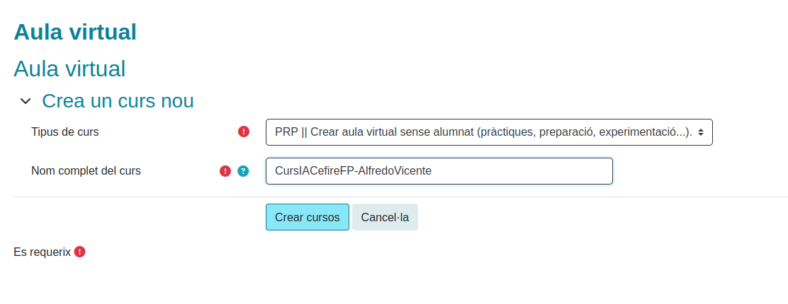{ width=70% }

:::caution
El curso tarda un poco  crea-se. Así que no os preocupáis.
:::

{ width=70% }

Y añadimos una sección.

\awesomebox[violet]{2pt}{\faRobot}{violet}{crea una división en html un titul que diga La célula y la fuente sea de color blanco y que tenga un fondo con las esquines redondejades que ocupo el 100 de su sección y el fondo sea a múltiples bandas alternas inclinadas 45 grados con los colores 4C4B16  y un color un poco menos oscuro. Es importante que el estilo esté todo contenido dentro de la misma división. Quiero que muestras solo la parte del cuerpo.}

El resultado ha sido lo siguiente:

```html
<body>
    <div style="background: repeating-linear-gradient(45deg, #4C4B16, #4C4B16 10px, #6C6B29 10px, #6C6B29 20px); border-radius: 15px; width: 100%; padding: 20px; text-align: center; color: white;">
        <h1 style="color: white;">La célula</h1>
    </div>
</body>
```

En Afig una actividad o recurso buscamos "Área de texto y multimedia" y copiamos el código sin la parte de body y nos aparecerá así:

{ width=90% }

:::caution
Tenemos que copiarlo haciendo clic en el botón de código (con rojo a la imagen).
:::

El reusultat se vería de este modo:

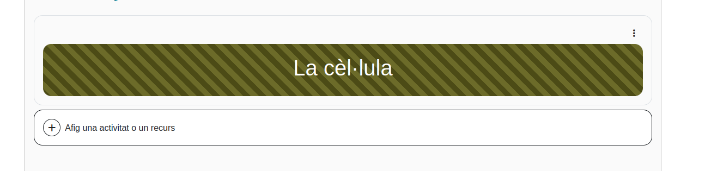{ width=90% }

Podemos crear títulos más pequeños modificando un poco el prompt:

\awesomebox[violet]{2pt}{\faRobot}{violet}{\textbf{Crea una división en html un título pequeño que diga "Contenidos" y esté lineat a la izquierda, la fuente del título sea de color blanco y que tenga un fondo con las esquines redondejades que ocupo el 100% de su sección y el fondo sea a múltiples bandas alternas inclinadas 45 grados con los colores #898121  y un color un poco menos oscuro, la altura de todo el contenido no tiene que ser demasiado grande. Es importante que el estilo esté todo contenido dentro de la misma división. Quiero que muestras solo la parte del cuerpo.}}

El resultado ha sido lo siguiente:

```html
<div style="font-family: 'Verdana', sans-serif; color: #fff; text-align: left; font-size: 1.2em; padding: 20px; width: 100%; height: auto; background: repeating-linear-gradient(45deg, #898121, #898121 10px, #6d6b16 10px, #6d6b16 20px); border-radius: 15px; margin: auto;">
    <h2 style="color: #fff; margin: 0;">Contenidos</h2>
</div>

```

Creo que recordaréis que crearemos un curso sobre la célula en el módulo 3, así que vayamos a aprovecharlo. Añadimos una actividad o recurso #URL que quedaría de la siguiente manera:

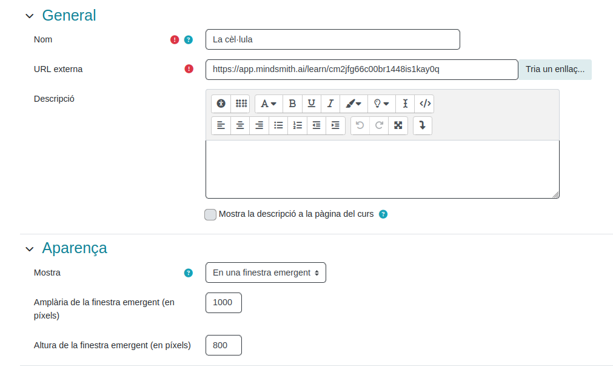{ width=70% }

Lo movamos a la derecha para darle un buen formato:

{ width=40% }

Y así se nos abre como en una ventana emergente el contenido:

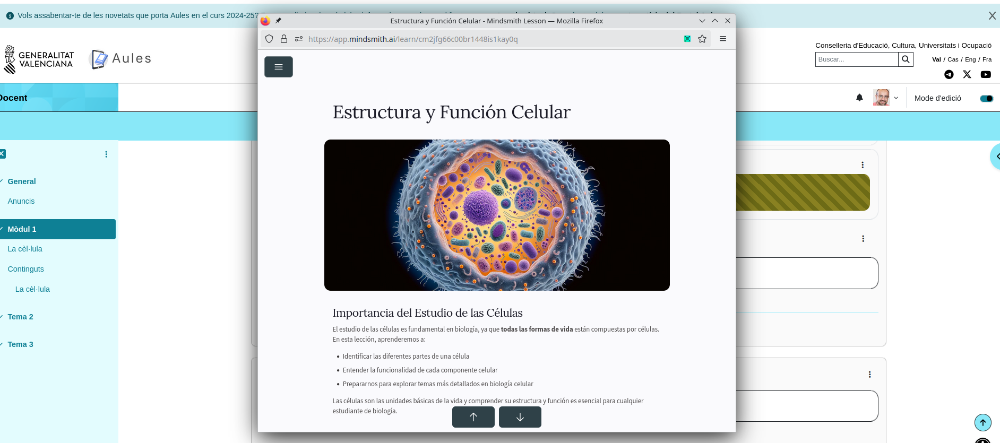{ width=90% }

## Actividades

Vayamos a crear una actividad de tipo cuestionario. Pero vamos a hacer uso de las herramientas que hemos aprendido a utilizar.

Iremos a [magischool](https://app.magicschool.ai/tools) y crearemos un cuestionario. En este caso haremos un cuestionario de 5 preguntas sobre la célula.

{ width=70% }

Creamos el qüestinari:

{ width=70% }

Y el resultado que tenemos es el siguiente:

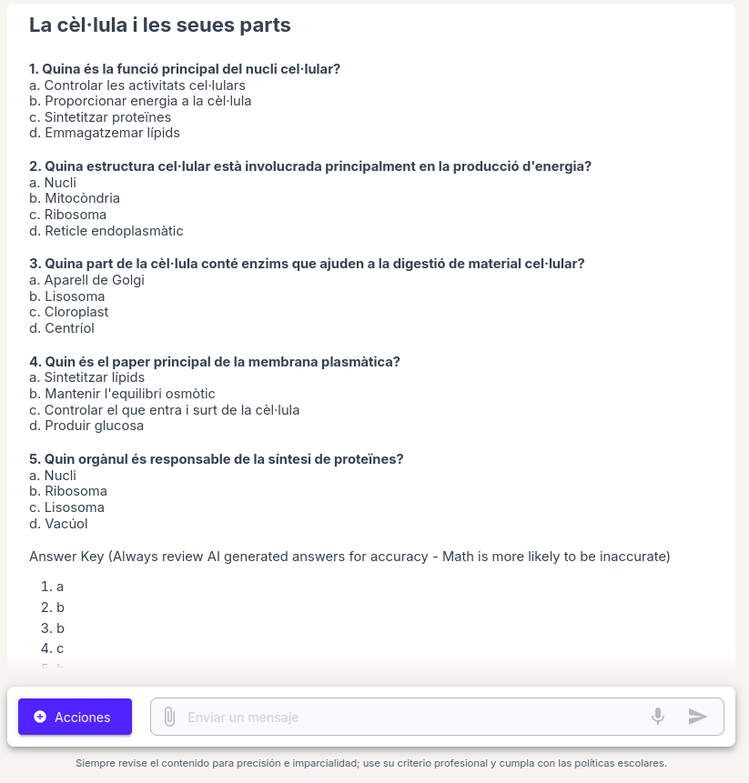{ width=70% }

:::caution
En este caso no podemos subir la web que hemos creado con mindsmith por las características de la plataforma, pero podemos subir nuestros propios apuntes.
:::

Pero a nosotros ente interesa que estas cuestiones estén en Aulas... Así que copiaremos el resultado y utilizaremos Copiloto:

\awesomebox[violet]{2pt}{\faRobot}{violet}{Crea un código xml para poder importar como cuestionario de moodle utilizant las siguientes cuestiones:\newline 
La célula y sus partes\newline
1. Cuál es la función principal del núcleo celular?  \newline
a. Controlar las actividades celulares  \newline
b. Proporcionar energía a la célula  \newline
c. Sintetizar proteínas  \newline
d. Almacenar lípidos  \newline
2. Qué estructura celular está involucrada principalmente en la producción de energía?  \newline
a. Núcleo  \newline
b. Mitocòndria  \newline
c. Ribosoma  \newline
d. Retículo endoplasmático \newline 
3. Qué parte de la célula contiene enzimas que ayudan a la digestión de material celular?  \newline
a. Aparato de Golgi  \newline
b. Lisosoma  \newline
c. Cloroplasto  \newline
d. Centriolo  \newline
4. Cuál es el papel principal de la membrana plasmática?  \newline
a. Sintetizar lípidos  \newline
b. Mantener el equilibrio osmótico  \newline
c. Controlar el que entra y sale de la célula  \newline
d. Producir glucosa  \newline
5. Qué orgánulo es responsable de la síntesis de proteínas?  \newline
a. Núcleo  \newline
b. Ribosoma  \newline
c. Lisosoma  \newline
d. Vacuola  \newline
Answer Key (Always review AI generated answers for accuracy - Math is more likely to be inaccurate)

a  
b  
b  
c  
b  }

Y el resultado ha sido lo siguiente:

```xml
<?xml version="1.0" encoding="UTF-8"?>
<quiz>
  <question type="multichoice">
    <name>
      <text>Cuál es la función principal del núcleo celular?</text>
    </name>
    <questiontext format="html">
      <text><![CDATA[<p>Cuál es la función principal del núcleo celular?</p>]]></text>
    </questiontext>
    <answer fraction="100">
      <text>Controlar las actividades celulares</text>
    </answer>
    <answer fraction="0">
      <text>Proporcionar energía a la célula</text>
    </answer>
    <answer fraction="0">
      <text>Sintetizar proteínas</text>
    </answer>
    <answer fraction="0">
      <text>Almacenar lípidos</text>
    </answer>
  </question>
  
  <question type="multichoice">
    <name>
      <text>Qué estructura celular está involucrada principalmente en la producción de energía?</text>
    </name>
    <questiontext format="html">
      <text><![CDATA[<p>Qué estructura celular está involucrada principalmente en la producción de energía?</p>]]></text>
    </questiontext>
    <answer fraction="0">
      <text>Núcleo</text>
    </answer>
    <answer fraction="100">
      <text>Mitocòndria</text>
    </answer>
    <answer fraction="0">
      <text>Ribosoma</text>
    </answer>
    <answer fraction="0">
      <text>Retículo endoplasmático</text>
    </answer>
  </question>
  etc...
```

Este texto lo copiamos en un fichero (creado con el notepad de windows) y lo guardamos como **questions.xml**.

En nuestro Aulas añadiremos un Cuestionario  "Añade una actividad o recurso":

{ width=90% }

No hay que modificar nada más, simplemente le damos a "Guarda los cambios y vuelve al curso" y ya tendremos nuestro cuestionario creado.

Y entraremos a nuestro cuestionario e iremos a Banco Banco de preguntas:

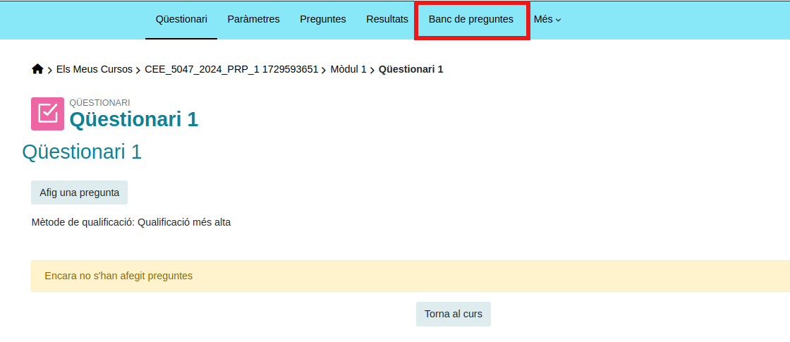{ width=90% }

Una vez aquí le damos a "Importa":

{ width=90% }

Tenemos que escoger las siguientes opciones:

* Formato XML de Moodle
* Arrastrar y soltar el fichero o navegar para subirlo

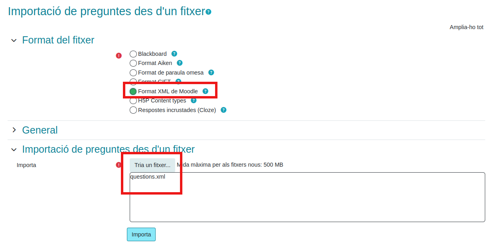{ width=90% }

Ahora podremos ver las preguntas que hemos creado:

{ width=90% }

:::tip
A partir de ahora os recomiendo estos pasos para tener las cuestiones un poco más organizadas en vuestro curso.
:::

Seleccionamos todas las cuestiones y desplegamos el menú de bajo y le damos a "Mueve a...":

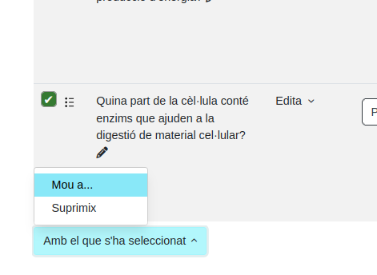{ width=90% }

Si este al Cuestionario 1 escogemos por defecto en Cuestionario 1 y le damos a "Mueve a":

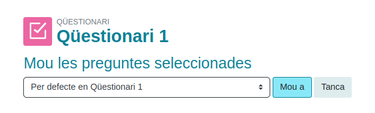{ width=90% }

Una vez hemos hecho esto tenemos nuestras preguntas en nuestro banco de preguntas, pero no esto no significa que estén al cuestionario, para posarlas al cuestionario tenemos que hacer el siguiente:

1. Vamos a nuestro cuestionario y le damos a "Añade una pregunta":

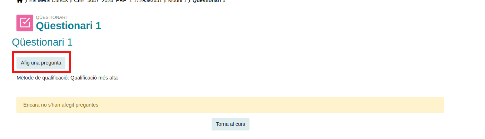{ width=90% }

2. Después vayamos al menú Añade y decimos del Banco de preguntas:
  
{ width=90% }

Finalmente escogemos la opción "Por defecto en Cuestionario 1" y hacemos clic en Aplica Filtros:

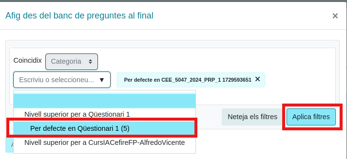{ width=90% }

Cuando aplicamos filtros Seleccionamos todas las preguntas y le damos a "Afeg las preguntas seleccionadas al cuestionario":

{ width=90% }

Y ya tendremos nuestras preguntas añadidas al cuestionario:

{ width=90% }

:::tip
Hemos hecho este proceso muy en detalle puesto que mucha gente se lia a los qüestinaris del Moodle. Para muchos de vosotros será una tarea sencilla. También es cierto que estamos hablando de 5 cuestiones, pero si volemos hacer un cuestionario de 20 preguntas puede ahorrarnos mucho trabajo.
:::

También podemos añadir:

\awesomebox[violet]{2pt}{\faRobot}{violet}{Crea un feedback del siguiente cuestionario de moodle: (Aquí añadimos el código de las preguntas de Moodle)
}

I la resposta serà esta amb un feedback de cada qüestió:

Fixeu-vos com ens ha afegit este camp:

```xml
      <feedback>
        <text>Correcto! El núcleo celular es el centro de control de la célula.</text>
      </feedback>
```

Aquí tindriem la respuesta, pero tiene un problema:

```xml
<?xml version="1.0" encoding="UTF-8"?>
<quiz>
  <question type="multichoice">
    <name>
      <text>Qué es la función principal del núcleo celular?</text>
    </name>
    <questiontext format="html">
      <text><![CDATA[<p>Cuál es la función principal del núcleo celular?</p>]]></text>
    </questiontext>
    <answer fraction="100">
      <text>Controlar las actividades celulares</text>
      <feedback>
        <text>Correcto! El núcleo celular es el centro de control de la célula.</text>
      </feedback>
    </answer>
    <answer fraction="0">
      <text>Proporcionar energía a la célula</text>
      <feedback>
        <text>No es correcto. La principal función del núcleo celular es controlar las actividades celulares.</text>
      </feedback>
    </answer>
    <answer fraction="0">
      <text>Sintetizar proteínas</text>
      <feedback>
        <text>Incorrecto. El núcleo controla las actividades celulares, no sintetiza proteínas directamente.</text>
      </feedback>
    </answer>
    <answer fraction="0">
      <text>Almacenar lípidos</text>
      <feedback>
        <text>No, el núcleo celular no almacena lípidos, controla las actividades celulares.</text>
      </feedback>
    </answer>
  </question>
  
  <question type="multichoice">
    <name>
      <text>Qué estructura celular está involucrada principalmente en la producción de energía?</text>
    </name>
    <questiontext format="html">
      <text><![CDATA[<p>Qué estructura celular está involucrada principalmente en la producción de energía?</p>]]></text>
    </questiontext>
    <answer fraction="0">
      <text>Núcleo</text>
      <feedback>
        <text>No es correcto. El núcleo no está involucrado principalmente en la producción de energía.</text>
      </feedback>
    </answer>
    <answer fraction="100">
      <text>Mitocòndria</text>
      <feedback>
        <text>Correcto! La mitocòndria es la fuente principal de producción de energía en la célula.</text>
      </feedback>
    </answer>
    <answer fraction="0">
      <text>Ribosoma</text>
      <feedback>
        <text>Incorrecto. Los ribosomas son responsables de la síntesis de proteínas, no de la producción de energía.</text>
      </feedback>
    </answer>
    <answer fraction="0">
      <text>Retículo endoplasmático</text>
      <feedback>
        <text>No, el retículo endoplasmático no es principalmente responsable de la producción de energía.</text>
      </feedback>
    </answer>
  </question>
  
  <question type="multichoice">
    <name>
      <text>Qué parte de la célula contiene enzimas que ayudan a la digestión de material celular?</text>
    </name>
    <questiontext format="html">
      <text><![CDATA[<p>Qué parte de la célula contiene enzimas que ayudan a la digestión de material celular?</p>]]></text>
    </questiontext>
    <answer fraction="0">
      <text>Aparato de Golgi</text>
      <feedback>
        <text>No es correcto. El Aparato de Golgi no contiene enzimas de digestión de material celular.</text>
      </feedback>
    </answer>
    <answer fraction="100">
      <text>Lisosoma</text>
      <feedback>
        <text>Correcto! Los lisosomas contienen enzimas que ayudan a la digestión de material celular.</text>
      </feedback>
    </answer>
    <answer fraction="0">
      <text>Cloroplasto</text>
      <feedback>
        <text>Incorrecto. Los cloroplastos no contienen enzimas de digestión de material celular.</text>
      </feedback>
    </answer>
    <answer fraction="0">
      <text>Centriolo</text>
      <feedback>
        <text>No, los centriolos no están involucrados en la digestión de material celular.</text>
      </feedback>
    </answer>
  </question>
  
  <question type="multichoice">
    <name>
      <text>Cuál es el papel principal de la membrana plasmática?</text>
    </name>
    <questiontext format="html">
      <text><![CDATA[<p>Cuál es el papel principal de la membrana plasmática?</p>]]></text>
    </questiontext>
    <answer fraction="0">
      <text>Sintetizar lípidos</text>
      <feedback>
        <text>Incorrecto. La membrana plasmática no es responsable de sintetizar lípidos.</text>
      </feedback>
    </answer>
    <answer fraction="0">
      <text>Mantener el equilibrio osmótico</text>
      <feedback>
        <text>No es correcto. La principal función de la membrana plasmática no es mantener el equilibrio osmótico.</text>
      </feedback>
    </answer>
    <answer fraction="100">
      <text>Controlar el que entra y sale de la célula</text>
      <feedback>
        <text>Correcto! La función principal de la membrana plasmática es controlar el que entra y sale de la célula.</text>
      </feedback>
    </answer>
    ...
```

En este caso Copiloto tiene un limit de tamany de respuesta, si volguerem hacer feedback de todas las cuestiones deuriem ir de dos en dos o de tres en tres, dependiendo de la longitud de las cuestiones.

:::warning
En ningún momento he revisado que las respuestas sean correctas, perfectamente podrían ser incorrectas. Así que es importante revisarlas.
:::

Finalmente para donarl-le un último toque en nuestro curso crearíamos un video.

## Video

Para crear un video podríamos utilizar la herramienta https://simpleshow.com/ que nos permite crear videos de manera sencilla y rápida. En este caso haremos un video de sobre la célula.

{ width=90% }

Tenemos que dar un título a la historia y crear nuestro guion del video:

{ width=90% }

:::tip
Para hacer el guion hemos utiltizat Copiloto que el resultado era mucho mejor.
:::

Finalmente puedes editar el video y cambiar las imágenes que utiliza, lo cual es muy recomendable en este caso puesto que su banco de imágenes no es demasiado grande. Pero podamos comprobar el resultado aquí:

[https://videos.simpleshow.com/jeqommgovt](https://videos.simpleshow.com/jeqommgovt)

Podríamos añadir el video en nuestro curso y ya tendríamos nuestra unidad completada.

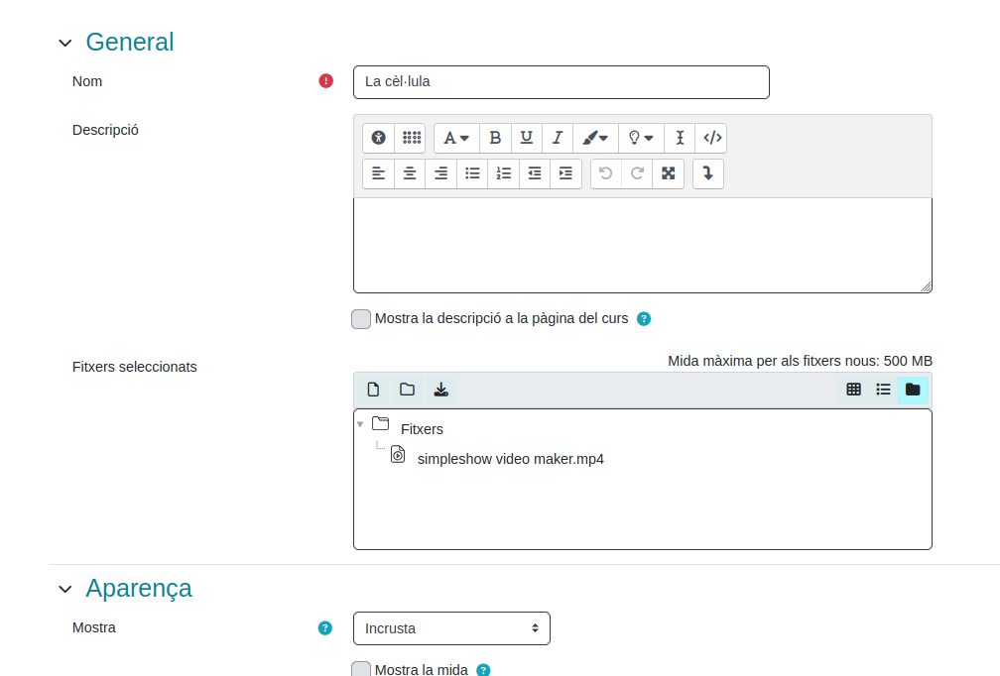{ width=90% }

## Conclusión

La inteligencia artificial no nos proporciona todo el trabajo hecho, sino que actúa como una herramienta poderosa para facilitar y agilizar nuestras tareas. Nos permite automatizar procesos repetitivos, generar contenido de manera eficiente y ofrecer soluciones rápidas a problemas complejos. Sin embargo, es esencial que los usuarios mantengamos un papel activo en la supervisión y validación de los resultados generados por la IA. Así, podemos asegurarnos que las soluciones propuestas se ajusten a nuestras necesidades específicas y mantienen un alto nivel de calidad. En resumen, la IA es una aliada que nos ayuda a ser más productivos y creativos, pero nuestra intervención y criterio continúan siendo fundamentales para obtener los mejores resultados.